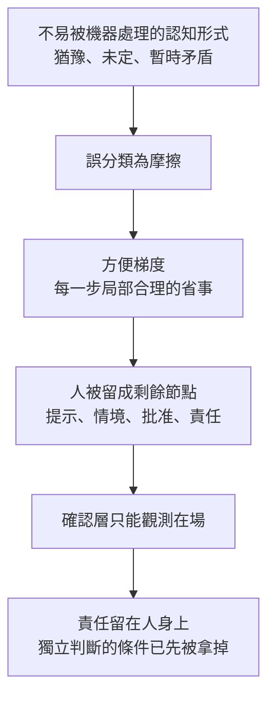

# 局部全綠不蘊含整體健康：加總的合法條件、成本的落點與被誤當成摩擦的判斷

**Structure**: Analytical Essay
**Date**: 2026-10-02T02:40
**Source**: notes
**Model**: GPT-6.1 Sol
**Agent**: GitHub Copilot Chat v0.68.0

## 導言 (Introduction)

設想一個團隊把各模組的開發速度提高了。每次合併都通過該模組的測試，每個小組的交付指標都在上升。半年後，整合階段的缺陷與返工越來越多，回頭逐項檢查，卻找不到任何一個「錯誤的決定」。這是設想，不是統計；它用來標出一種常見的形狀：每個局部的檢查都為真，整體卻在劣化。

直覺的修法是增設整體負責人、增加覆核次數，或換一個更難操弄的指標。這些做法預設錯誤住在決策之間的縫隙，只要有人看守就會現形。本文要檢查這個預設。核心問題是：在什麼條件下，才能從「每個局部評價都為正」推論「整體評價為正」？條件不成立時，缺口出現在哪裡，怎麼辨認？以及為什麼其中一種缺口，也就是成本被移進人的判斷能力，最難被局部指標看見？

本文的答案分四步。第一步，把整體評價拆成各局部評價之和與一個殘差，說明加總要成為整體評價需要哪些條件。第二步，用兩起公開調查過的太空任務事故，展示缺口如何出現在局部交會處與檢查的範圍之外。第三步，區分成本落在函數之外的兩種情形，並說明「低摩擦」為何常常只是位移。第四步，處理一種特殊的位移：人的猶豫、反覆與未定被當成摩擦拿掉，而確認層（confirmation layer）只能證明人在場。

適用範圍要先講清楚。本文不處理後果該由誰付帳的制度設計，也不主張限制自動化。證據分兩類：公開調查報告（亞利安五號、火星氣候軌道器）用於檢驗交叉項與評價範圍的缺口；標明「設想」的情境與本文推論的機制，只用來說明機制，不是實測資料；第五節處理的位移沒有對應的公共事故調查，證據強度因此較低。

## 分析 (Analysis)

### 一、局部評價的加總，在什麼條件下才是整體評價

局部自洽（local coherence）指的是：在一組假設、一個目標與一條邊界之內，一個決定可以被推出。它是條件句。前提與邊界若沒有隨每次決策重新受審，內部愈一致，只可能表示外部矛盾被排除得愈徹底，不表示它對整體仍然合適。因此一致、局部有效與系統有效是三件事，後一件比前一件多一個條件，多出來的條件不會由前一件的通過自動滿足。

把整體評價記為 $Q(d_1,\dots,d_n)$，第 $i$ 個局部對自己決定 $d_i$ 的評價記為 $q_i$。$q_i > 0$ 只表示該局部判定可接受，沒有單位，也不是測得的分數。對任意一組局部評價 $q_i$，都可以把整體評價與它們的總和之差定義為殘差 $R$：

$$
Q = \sum_i q_i + R
$$

這個式子是定義，不排除任何情形，也不保證 $R$ 只含交會貢獻。若每個決策只有有限個選項，另有一個更強的結構可用：整體評價可以相對於某個指定的基準編碼，唯一地分解成基準值、各決策的單獨貢獻，以及兩個以上決策交會時才出現的貢獻。統計實驗設計稱後者為交互作用（interaction），其中每一項稱為交叉項（cross term）。只有當 $q_i$ 恰好等於這種分解中的單獨貢獻時，$R$ 才純粹由交叉項組成。實務上不是這樣：團隊算出的 $q_i$ 是把其他決策放在「自己假設的狀態」下得到的值，混著一部分交會貢獻；假設若不成立，$q_i$ 本身就失去依據。本文推論，組織決策可以借這個分解說明問題，但實際的 $R$ 通常無法被估計。為簡化，下文把整體評價以基準狀態為零點來表示，因此基準值為 0。

於是「所有 $q_i > 0$ 推出 $Q > 0$」的結構是：在 $Q = \sum_i q_i + R$ 之下，符號只由第三項決定；但這個式子能不能被讀成對整體的描述，取決於前兩項。本文推論，下列三項合起來是這個推論的前提；它們是解讀的檢查清單，不是一個定理。此外各 $q_i$ 必須在共同的尺度上才能相加，本文的數字是任意單位：

1. 量測一致：每個 $q_i$ 量的是 $Q$ 所關心的那件事，而不是一個被改名的代理量。
2. 假設仍然成立：每個 $q_i$ 預設的其他決策與環境狀態，在實際運作時仍然存在。
3. 殘差不翻轉：$R > -\sum_i q_i$。在所有 $q_i$ 為正時，這恰好是 $Q > 0$ 的充要條件。

下面用兩組設想的數字檢查這個陳述。單位是任意的，這裡不是測量結果。設三個局部評價為 $q = (2, 3, 1)$，其和為 6。若 $R = -1$，則 $Q = 5 > 0$，局部全正與整體為正相容。若 $R = -8$，則 $Q = -2 < 0$，局部全正而整體為負。第二組數字不是在說這種情形經常發生，它排除的是一種推論：既然每一項局部檢查都過了，整體就過了。

數量上的差別說明為什麼多派人覆核補不上缺口。設每個決策只有採用與不採用兩個水準，每個決策子集算一個交會項，則 $n$ 個決策有 $n$ 個局部評價，卻有 $2^n - n - 1$ 組可能的交會項：四個決策是四個局部評價、十一個交會項（六組兩兩、四組三者、一組四者）。每多一位覆核者，增加的是第一側的檢查次數，第二側的項不會因為覆核更勤而進入任何函數。這個數量只是項數，不是項的大小。多數高階交會項在實務上很小，這正是加總通常可用的原因，也是它失敗時局部檢查看不見的原因：所有檢查都在第一項。組合式測試（combinatorial testing）把「涵蓋任意 $t$ 個因子的所有交會」當成測試設計的目標；其經驗依據之一，是 Kuhn 等人（2004）在〈Software fault interactions and implications for software testing〉中對軟體失效紀錄的分析，用來估計觸發一個失效需要多少個因子同時存在。本文不複述其數字，因為本次沒有讀其全文；這裡借它說明：交會項的階數可以經驗地估計，也有現成的測試方法專門去找它們。

這同時回答了整體負責人的問題。若負責人拿到的是各局部的通過紀錄，他算的仍然是 $\sum_i q_i$，只是多蓋了一個章。整體審視的價值不在於看得更廣，而在於它用的是不是另一個函數，一個把兩個以上局部的實際交會放進輸入的函數。

### 二、兩個已發生的現場：缺口在交會，與缺口在檢查的範圍

火星氣候軌道器（Mars Climate Orbiter）於 1998 年 12 月 11 日發射，1999 年 9 月 23 日在火星軌道插入期間失聯。事故調查委員會的第一階段報告把根因寫成：一個地面軟體檔案「Small Forces」沒有使用公制。介面規格要求推力衝量以牛頓秒表示，該軟體輸出的卻是磅力秒；導航軟體依規格把它當成牛頓秒使用，因此低估了推進器作用，差了 4.45 倍。報告同時寫到：預計的第一次近火點高度是 226 公里，事後以修正值估算是 57 公里，這次操作被認為可存活的最低高度是 80 公里（Stephenson et al., 1999）。

報告還記了另一個因素。由於太陽能板不對稱，角動量解飽（Angular Momentum Desaturation, AMD）的推進事件，比導航團隊預期的多了 10 至 14 倍。報告寫道，增加的 AMD 事件，加上資料用的是英制而非公制，使小誤差在九個月的航程中累積起來（Stephenson et al., 1999）。報告沒有把這兩項寫成相乘關係，也沒有分別量出各自單獨存在時的效果。下面的模型把它們當成兩個可以分開討論的因子，並以乘法累積作為設定（本文模型設定），用來示範缺口的結構。

下面的模型只檢查一件事：在把誤差當成線性累積的設定下，把兩個因子各自單獨檢查的結果相加，能不能預測它們並存的結果。它不計算真實軌跡誤差，也沒有納入導航團隊的任何其他修正。數值設定：單位錯誤使模型只吸收真實作用的 $1/4.45$；事件頻率取報告所列 10 至 14 倍的中點 12；基準頻率下單一事件的真實作用記為 1。

```python
K_UNIT = 4.45   # 英制衝量被當成公制時，模型低估作用的倍數
F_HIGH = 12.0   # 事件頻率為預期的倍數；取報告所列 10 至 14 倍的中點

def residual(wrong_units: bool, event_factor: float) -> float:
    """未被模型吸收的作用；基準頻率下單一事件的真實作用記為 1。"""
    modeled_share = 1 / K_UNIT if wrong_units else 1.0
    return event_factor * (1 - modeled_share)

base = residual(False, 1.0)
only_units = residual(True, 1.0)
only_freq = residual(False, F_HIGH)
both = residual(True, F_HIGH)

additive_forecast = base + (only_units - base) + (only_freq - base)
cross_term = both - additive_forecast

assert only_freq == 0.0                       # 頻率偏高但單位正確：沒有殘差
assert 0 < only_units < 1                     # 單位錯誤但頻率正常：殘差有限
assert cross_term > 0                         # 兩個單因子結果相加，預測不了並存
assert abs(cross_term - (F_HIGH - 1) * (1 - 1 / K_UNIT)) < 1e-9
assert both > 8 * max(only_units, only_freq)  # 單因子檢查看到的，不到並存結果的八分之一
```

依所列設定計算，單因子逐一檢查（one-factor-at-a-time）看到的最大殘差是 $1 - 1/4.45 \approx 0.775$，並存的殘差是 $12 \times 0.775 \approx 9.3$，前者約為後者的十二分之一。Czitrom（1999）在〈One-factor-at-a-time versus designed experiments〉中討論了這一點：一次只改變一個因子的做法無法估計交互作用，而交互作用存在時，它會誤導對各因子效果的判斷。這個模型的假設是設定，不是觀測；它不證明真實誤差的量值，也不證明事故中兩個因子真的以乘法互動。它示範的是結構：在所設定的規則下，存在一種缺口，缺口裡的項不在任何單因子檢查的函數中。

報告沒有記載「哪一項局部檢查把單位錯誤放行」。它記載的是整條鏈上本該接住這個錯誤的環節沒有發揮作用：寫明單位的介面規格沒有被遵守，導航團隊沒有及早拿航天器自己算出的速度變化與追蹤資料做比對，團隊遇到資料衝突時用電子郵件處理，沒有走正式的事件、意外、異常通報程序（ISA），報告認為沒有善用問題追蹤系統，使這個問題「從縫隙中漏過」（Stephenson et al., 1999）。這個縫隙有位置也有程序，只是程序沒有被使用，遵守程序至少能使疑慮進入正式紀錄；本文模型所示的交會項沒有位置，遵守任何一項局部程序都補不上。兩者在這個現場可以同時存在，補了前者不會使後者消失。報告對另一艘任務的建議之一，是對所有在團隊之間傳遞的資料做介面規格符合性的軟體稽核（Stephenson et al., 1999）。Oberg（1999）在 IEEE Spectrum 的報導引述 NASA 官員的說法，也指向同一處：問題不在那個錯誤本身，而在系統工程與流程中的制衡未能偵測到它。

亞利安五號（Ariane 501）是第二種缺口。1996 年 6 月 4 日首飛失敗。歐洲太空總署與法國國家太空研究中心成立的獨立調查委員會把原因寫成：主引擎點火程序開始後 37 秒，導引與姿態資訊完全丟失，起因是慣性參考系統軟體的規格與設計錯誤；兩套慣性參考系統同時失效。發射計畫中的廣泛檢視與測試，沒有對慣性參考系統或完整飛控系統做足夠的分析與測試，因而沒有偵測到這個潛在失效。新聞稿特別指出，對齊功能只在升空前有用，升空後卻仍在運作，這項功能沒有被納入模擬；設備與系統測試也不夠代表實際發射。同一份稿件還寫到，計畫期間的檢視與測試做了數千次修正，但軟體的系統作法上的缺陷使這個錯誤沒有被偵測到（Inquiry Board, 1996）。

用第一節的三項前提讀，亞利安五號失敗的位置與火星氣候軌道器不同。評價用的環境缺了一個實際運作區間，也就是升空後仍在運作的對齊功能，這是前提 2（假設仍然成立）的缺口，不是兩個因子相乘。兩套系統同時失效而新聞稿把原因歸為軟體的規格與設計錯誤，這是否意味冗餘沒有分擔這個失效，本文推論：若同一個設計錯誤同時存在於兩套之中，冗餘分擔的只是隨機故障，不是同源的設計錯誤；新聞稿沒有進一步說明冗餘設計，這一句不是來源事實。

這兩個現場給「交會」一個更精確的位置。Perrow（1999 年更新版《Normal Accidents》）以交互複雜性（interactive complexity）與緊耦合（tight coupling）解釋，為什麼有些系統裡的事故不能靠強化單一元件避免。 Leveson（2004，〈A new accident model for engineering safer systems〉）把事故模型從元件故障的連鎖，改為對元件之間交互缺乏有效約束。本文只借用這兩項文獻對「交互」的定位，不判定上述兩起事故屬於哪一種理論分類，也不聲稱這兩條路線的結論相同。

「換函數」在這兩個現場的具體形狀也有紀錄。ESA 新聞稿列出的改進措施包括：以真實設備與元件提高資格測試環境的代表性、用真實軌跡模擬慣性參考系統電子設備、在設備、火箭級（stage）與系統三個層級的連續測試之間引入重疊，以及改善設備與系統之間雙向的資訊流動（Inquiry Board, 1996）。同一篇報導記錄，火星氣候軌道器的調查主席事後在記者會上說，若做過端到端測試，這個錯誤可能被抓到。這些措施的共同形狀是：讓某次評價的輸入包含兩個以上局部的實際交會，不是更仔細地讀各局部的通過紀錄。

### 三、成本落在誰身上：後果測試

第一節的前提 1 還有另一種失敗：$q_i$ 量的不是整體關心的總成本，而是其中一部分。做決定的局部把成本移出自己的函數，函數當然仍為正。這可以分成兩種情形。

外部性（externality）是做決定的局部沒有把某項後果放進自己的函數，可能不知道它落在哪裡，也可能知道，但函數的定義本來不含那一項。成本轉嫁（cost shifting）多一個條件：做決定的人知道主要後果會落在別處，並且函數的正號依賴這個落點。兩者的測試不同。問「你知不知道後果在別處」，答不知道，仍可能是外部性。問「若後果必須由你承受，你還會做這個決定嗎」，答不會，才是成本轉嫁。第一個問題問資訊，第二個問題問函數是否依賴落點。只補資訊，停不了成本轉嫁。第二個問題是反事實問題，答案也可能反映風險偏好或資源限制，不只是依賴落點；把它當成診斷使用時，還需要另外確認做決定者知不知道後果落在哪裡，以及改變落點之後決定是否真的改變。

設想一個支援流程：第一個團隊的目標是降低自己的平均處理時間，於是把複雜案件更早轉出。它的時鐘變短，沒有作弊。多出來的時間出現在下一個團隊。若被要求把轉出之後的時間算進自己的時鐘，提早轉出就不再是成功，所以這是成本轉嫁。若轉出當時還沒有可指認的承受者，同一個決定更像外部性。兩者局部評價都為正，補救方法不同。這是用來區分兩種情形的例子，不是營運紀錄。

後果測試還要與另一個常被拿來切邊界的判準區分。共變判準問：這些概念是否總是因同一類變化而一起改，若是，就該放在同一個局部。後果測試問：住定之後，這個局部的合理決策，主要後果會不會跑出去。設想一組總是一起改的計費規則放在同一個局部，共變通過；這個局部為了讓自己的規則保持簡單，把稅務例外推給結帳流程處理，後果測試失敗。把這個局部拆小，改變的是邊界數量，不是付帳位置。反方向亦然：兩個很少一起改的模組被放在一起，共變判準失敗；若其中一個決定的後果仍由它自己承受，拆開不是為了停止成本轉嫁。兩個測試要分別通過，局部自洽才開始像品質訊號。

共變判準自己也有邊界。局部要發揮正向作用，不是範圍愈小愈好，而是大部分因果、語義與責任能在局部內閉合，跨出去的部分少到可以被契約明確描述；這是最小可閉合單元，不是最小單元。縮得太小，邊界數量上升，契約數量跟著上升，複雜度從節點搬到邊上，得到的不是模組化，而是一張沒有人讀得完的契約圖。反過來，後果落在局部自己身上的決定，局部為正才是品質訊號。設想一個團隊改自己的建置，建置變慢的時間由它自己等，沒有下一個團隊吸收這段等待；這時局部評價為正，是因為這個團隊判斷變慢的代價小於它換來的東西，測試通過。後果測試也不決定契約該寫多細：契約寫得愈細，愈能描述跨界的部分，也愈把複雜度搬到邊上。它只決定一件事：在當前粒度下，合理決策的主要後果若由別人付，這個局部的自洽就不是正向訊號。

火星氣候軌道器不應被讀成成本轉嫁的例子。報告記錄的是單位不符合介面規格、檢查鏈沒有接住，沒有記錄產出端明知有誤並依賴這一點讓自己達標（Stephenson et al., 1999）。一個決定的主要後果落在做決定者之外，是後果測試失敗；是否升格為成本轉嫁，需要第二個問題的答案，而這份紀錄沒有回答。

讓後果回到做決定的局部，停住的是這一類失敗，不是第一節所有的缺口。三個局部各自承受自己決定的直接後果，三個決定交會時才出現的那一項，仍然不在任何一個函數裡。後果測試補的是前提 1，不補前提 3。

### 四、低摩擦：解決還是位移

成本移出函數的一種常見外觀，是某個局部感到阻力下降。上游的等待、質疑、退回變少，體感變順。這個讀數與「衝突被解決」之間沒有蘊含關係：

$$
\text{上游摩擦下降} \not\Rightarrow \text{衝突被解決}
$$

左式可以直接觀測，右式要另外證明。同一個下降至少有三種讀法：衝突真的被解決了、衝突被位移到別處或之後、或原本就沒有衝突可撞。下表列出每種讀法預期看到什麼，也列出要分辨它們需要的觀測。

| 讀法 | 下游返工與延後成本 | 下降之前是否有被命名、有範圍的碰撞 | 該如何下結論 |
| :--- | :--- | :--- | :--- |
| 被解決 | 不增加 | 有，並有結束方式 | 摩擦下降可以讀成改善 |
| 被位移 | 增加，或在較晚的時點出現 | 沒有，差異沒有被說出 | 上游的正號依賴成本落在別處 |
| 原本沒有衝突 | 不增加 | 沒有，但差異本身很小 | 下降不可解釋，不代表改善 |

這張表的用法是：只看到上游摩擦下降，三列都相容。要區分它們，必須回頭查下降之前有沒有一次真正的碰撞，以及下游的返工與延後成本有沒有同步改變。

設想一個把規格當成「整合已經完成」的團隊：需求、規格、設計、實作像一條直線，上游每一個分岔都被同一份文件暫時壓平。流程看起來很順，實際上是多個判斷被一份文件壓平，到了實作階段才重新展開。實作者面對的不是實作一份已定的規格，而是補解釋、補衝突處理、補沒寫下的語義。本文推論，在這種安排下，付帳的時點被推後，推到衝突更貴、更難反悔的位置；這是機制說明，不是每次位移都會變貴的結論。若把「AI 讓模組的合併速度變快」設想成同一個結構，快的是各局部的產出，而整合與驗證的產能沒有同步增加，則局部指標仍為正，總成本卻在別處累積。這個設想沒有資料支持其普遍性，本文只用它指出要追的方向：下游。

### 五、最難看見的位移：成本移進判斷能力

前四節討論的成本都有一個可以被命名的落點：下游的時間、返工、缺陷。本節處理一種沒有帳面落點的位移。猶豫、反覆、語義未定、暫時矛盾與長時間醞釀，常常在一個回合裡不產生單義的下一步，也不能穩定地寫成欄位。對一條要保持可讀、可銜接的流程來說，它們是摩擦。對形成一個不全由當前提案生成的判斷來說，它們可能是判斷還能發生的形式。

本節的論證建立在機制推理與下面引用的自動化研究上，沒有對應的公共事故調查，所以它的證據強度低於前兩節：它指出一種可以檢查的結構，不報告某個組織的實測。它可以概括為兩句話：人仍保留責任，卻失去形成獨立判斷的認知厚度；人類在迴路中不夠，人必須帶著自己的模型。

核心的誤分類（misclassification）是：把不容易被機器處理的認知形式，誤認為應該被消除的摩擦。這個分類方向可以檢查。一件活動被拿掉，若理由只是它使流程不能在本回合收成單義輸出，拿掉的理由是機器的處理邊界，不是這件活動對判斷無益。反方向是本文不反對的消除：一件活動被拿掉，是因為它對判斷沒有貢獻，而且這個判斷不依賴它好不好被機器讀取。兩個方向表面都叫消除摩擦，只有後一個是消除摩擦。

分類不會以禁令出現。它以更方便出現：幫你總結，省掉重讀；幫你決定，省掉未定；幫你改寫，省掉暫時矛盾；幫你省掉確認，省掉一次還可能反悔的停頓。這個方便梯度（convenience gradient）的每一步在自己的範圍內都說得通；本文推論，累積後，省掉的是機器不好處理的那一種，留下的是機器好處理的那一種。人不必被說服改用另一種認知，只需要一次又一次接受更方便的那一步。

方便梯度走到盡頭，人不是消失，而是被留成四種這套系統用得上的功能：提供提示、供應情境、批准、承擔責任。這四個是介面，介面的定義是：系統能接收什麼、能發出什麼、在哪個節點等待一個外部訊號。一個不能被寫成這四種輸入或等待的認知活動沒有插槽：未定沒有插槽，矛盾沒有插槽，還在醞釀的判斷沒有插槽。本文不把這四個節點寫成無用，提示、情境、批准、責任歸屬都可以是真的工作；問題在它們被當成剩餘的全部。這是本文推論。

自動化研究早就描述過這個形狀的一部分。Bainbridge（1983，〈Ironies of automation〉）指出，自動化讓人類操作者留下的，是設計者想不出如何自動化的那些任務；而人類因為不再日常練習，技能會退化，卻要在系統出問題時接手。本文用它的位置只限於這個結構：留給人的是剩餘，剩餘不等於認知活動的全部。Parasuraman 與 Manzey（2010） 對自動化使用中的過度依賴（complacency）與自動化偏誤（automation bias）做了整合性回顧，指出這兩種現象同時見於新手與專家，且不能單靠簡單練習克服。 Skitka 等人（1999，〈Does automation bias decision-making?〉）在決策輔助的實驗中報告，使用自動化輔助時，參與者較易出現遺漏與誤從這兩類錯誤。這些研究支持的是：「人在場」與「人有效監督」是兩件事。它們不證明某一個具體產品的確認層無效。

把人留在迴路裡，常用一個流程圖表示：提案、人類確認、行動。這張圖回答的問題要分開。它能回答人是否在某個節點被等待。它不能回答這個等待檢查了什麼。下面用集合說明這個差別。令 $A$ 為確認紀錄中所有被標為「已確認」的案例，$U$ 為其中確認者形成了不全由該提案生成之判斷的案例，所以 $U \subseteq A$。確認層能觀測的是成員資格 $A$，不能觀測 $U$。對紀錄內容完全相同的兩個案例，任何只依賴紀錄內容的規則都不能區分它們；因此只要有一個屬於 $U$、另一個屬於 $A \setminus U$ 的案例在紀錄中相同，就無法由紀錄建立 $U$。設想一位確認者對照了自己的模型後確認，另一位在數秒內按下確認；兩者在紀錄中完全相同。前者屬於 $U$，後者屬於 $A \setminus U$，紀錄分不開。這個陳述的違反情形就是「紀錄能分開兩者」，那需要紀錄包含判斷的內容，而不只是在場。授權的範圍還大於確認者看見的範圍：提案一旦被標成已接受，後續步驟就以這份文本為前提，不再回頭懷疑它；確認者看見的是眼前這一段，授權的是所有以這段為前提的後續，而那些後續在確認當下還沒有生成。

Green（2022）回顧實證研究後主張，要求人類監督政府演算法的政策，其前提（人能有效監督）缺乏證據支持，並且可能替有缺陷的演算法提供正當性。 Elish（2019）以「道德壓縮區」（moral crumple zone）描述這種配置：責任可能被錯誤地歸給一位對自動化系統的行為只有有限控制的人，就像車體的壓縮區吸收撞擊的力量一樣。這兩項文獻與本文的連接是：責任留在確認者身上，而形成獨立判斷的條件在確認之前就已被分類拿掉。

下圖把這條因果鏈畫成狀態移動。圖中每個箭頭都是本節已說明的一步，不是新增的步驟。



這張圖的關鍵在於順序。確認層在鏈的末端，不是開端。文本抵達確認層之前，若已被收成沒有反駁位置的單義句子，確認者面對的就不是還能反悔的分岔。把確認流程設計得更嚴格，或找更資深的確認者，改變的不是被檢查的謂詞，謂詞仍是在場。把「確認層設計錯誤」當成病因，會把後果寫成病因。

下表比較同一個「省掉麻煩」在不同分類方向下的意義。

| 被省掉的活動 | 拿掉它的理由 | 抵達確認層的文本 | 在場為真時能說什麼 |
| :--- | :--- | :--- | :--- |
| 猶豫、未定、暫時矛盾，因為本回合收不成單義輸出 | 機器的處理邊界 | 已經通順，沒有可反駁的位置 | 人在場，不能說人形成了判斷 |
| 只是重複傳遞、對判斷沒有貢獻的等待 | 該活動對判斷無益 | 不依賴這段等待也可評估 | 若契約只要求授權，在場就夠，這不是本文的病 |
| 決定改由機器做出並如實標示，確認層一併拿掉 | 不再假裝有人判斷過 | 沒有確認層 | 可以說機器做了決定，不能說被拿掉的認知形式已經回來 |

第一列是本文的失敗。第二列是本文不覆蓋的消除，有些確認本來就只證明授權與責任歸屬，例如法定簽署。第三列說明拿掉確認層，讓責任的外觀與實際做決定的位置重新對上，但不把被削掉的形式還原。還原要發生在分類那一步。本文建議三個可檢查的條件，用來避免在分類那一步就失去判斷，這三條是設計建議，沒有被本文檢驗過：第一，拿掉一項活動之前，寫出拿掉的理由是「對判斷無益」還是「機器處理不了」；第二，抵達確認層的文本保留可反駁的形狀，例如附上它依賴的假設與尚未解決的矛盾；第三，確認要求確認者先寫下自己的預期，再看提案，使紀錄中包含一個不由提案生成的觀察。

## 反思 (Reflection)

加總並不總是錯的。一組彼此獨立的批次作業，每個作業的失敗不改變其他作業的輸入，整體的失敗數就是各作業失敗數之和，殘差不存在。指派一個整體負責人去重算交叉項，是多餘的。兩個系統可以長得一樣整潔，判準不是整潔，而是第一節的三項前提有沒有被檢查。

三項前提是解讀的檢查清單，不是本文證明的定理，也沒有被經驗資料檢驗。殘差 $R$ 在實務中通常無法被估計，所以三項前提中，最難由局部檢查回答的是第三項。本文能給的只是方向：用包含實際交會的評價去查，而不是提供一個可以計算 $R$ 的公式。

後果測試本身可以被遊戲化。若「主要後果由本局部承受」變成一個要勾選的欄位，局部會學會把後果重新命名，直到它看起來落在自己的邊界內。Goodhart 定律（Goodhart's law）的形狀是：一個被拿來控制的統計規律，會傾向崩解；Campbell 定律（Campbell's law）補的是社會面：量化指標愈被用來做決策，愈承受腐化壓力（Goodhart, 1984；Campbell, 1979）。本文只把它們當作邊界使用：測試的力量來自分歧還能被指出，不來自多一個必填欄。

這些結論也容易被收成幾個不屬於本文的說法。第一，「沿用舊設計就是錯」：沿用在舊前提裡可以是合法的，失敗發生在前提改變而評價沒有跟著改變，該被要求的是沿用之前重新檢查前提 2。第二，「冗餘沒有用」：冗餘分擔隨機故障仍可能有用，本文只指出用同一份通過紀錄檢查兩個模組，檢查的仍是第一項。第三，「人被取代」或「人變笨」：人沒有消失，也不是先失去智力才被留下簽字；不再被日常環境要求使用的形式，可能因為沒有插槽而不再被使用，這是使用條件消失的結果，本文不依賴「人已經變笨」。第四，「認知不該外包」：外包可以只交出計算，人仍可帶著自己的模型讀一份沒有被提前收成單義句子的文本。把主題寫成外包的風險與收益，會把無害的那一半算進病裡。

本文沒有證明的事也要寫明。AI 加速合併的情境是設想，沒有資料支持其普遍性；自動化研究顯示的是特定環境下的傾向，沒有被本文用來估計任何一個組織的程度；技能因缺乏練習而退化，本文沒有測量。一個更強的情形也未處理：當選項空間無法列舉，或整體評價沒有被明確定義時，第一節的分解能否成立需要另外說明，本文只把它當成類比使用。本文的結論不依賴這種情形，推不出已經足夠。

最後，第五節留下四個可操作的問題，它們是出口，不是新的病因：哪些認知活動不能被完全外包，哪些摩擦應保留，哪些決策必須要求人保有自己的模型，產品如何暴露自己的認知邊界。沒有先寫出誤分類，回答它們會再次從要求開始，而不是從病因開始。

## 實務對比 (Practical Contrastive Examples)

下表把四種常見的「局部全綠」並排，說明每一種還需要另外確認的條件，以及什麼樣的評價才算換了函數。

| 讀到的局部訊號 | 還要確認的條件 | 換函數的做法 | 仍然看不見的東西 |
| :--- | :--- | :--- | :--- |
| 各模組測試全過 | 假設仍然成立（前提 2）；兩個以上局部的交會被納入 | 以真實設備與真實運作條件做系統層測試，並在各層級之間重疊測試 | 仍未被納入的運作區間 |
| 小組指標改善，例如處理時間下降 | 量測一致（前提 1）；主要後果由做決定的局部承受 | 把轉出之後的成本計入同一個函數；問「若由我承擔，還會這樣決定嗎」 | 三個以上決策交會時才出現的項 |
| 上游摩擦下降 | 下降是解決、位移，還是原本沒有衝突 | 追下游返工與延後成本，查下降之前有沒有被命名的碰撞 | 沒有記錄的隱性成本 |
| 人類確認已記錄 | 在場不等於判斷 | 文本保留可反駁的形狀；確認者先寫下預期 | 確認者實際持有的模型 |

火星氣候軌道器落在第一列。每一條資料鏈都在自己的範圍內運作，單位錯誤與事件頻率的相乘不在任何單因子檢查之內；被引入的措施是端到端與介面規格符合性的檢查。亞利安五號也落在第一列，但缺口是前提 2：評價環境缺了升空後仍在運作的對齊功能。第二到第四列沒有對應的公共事故調查，它們使用的是設想情境與機制推論，不能與前兩個現場的證據強度相提並論。

## 結論 (Conclusion)

局部評價全為正，推不出整體評價為正。加總要成為整體評價，至少要量測一致、假設仍然成立，並且殘差不足以抵消局部的正值；缺任何一項，局部通過只證明那一項局部成立。

缺口有不同的形狀。兩個因子各自有限、並存才放大，是交叉項，單因子檢查看不到。評價環境缺了實際運作區間，是前提 2 的缺口。成本被推出做決定者的函數，是前提 1 的缺口，其中「若由我承擔還會決定嗎」可以分開外部性與成本轉嫁。補其中一項，不補其他項。

低摩擦只是一個讀數。它同時相容於解決、位移與原本沒有衝突，要區分必須回頭看下游的成本與下降之前有沒有被命名的碰撞。最難看見的位移是成本移進判斷能力：不容易被機器處理的認知形式被誤分類為摩擦，方便梯度把人收成剩餘，確認層只能證明在場，責任仍留在人身上。還原要發生在分類那一步，不是最後一個按鈕。

整體審視的價值不在更廣的視野，而在換一個評價函數，讓兩個以上局部的實際交會成為它的輸入。

## 參考文獻 (References)

文中以（作者, 年份）標示出處，條目依作者字母排序。讀取日期為 2026-10-02。事故事實以所列調查報告及 ESA 新聞稿為限；火星氣候軌道器的報告 PDF 以 NASA 經驗教訓資料庫連結讀取。亞利安五號的獨立調查委員會報告全文，其 PDF 在本次讀取中沒有可擷取的文字層，因此亞利安五號的事實只引用 ESA 新聞稿公開轉述的部分。含「報告對照」的說明僅界定引用範圍。本文的模型、集合與數值為明示設定，不是實測。

- Bainbridge, L. (1983). Ironies of automation. *Automatica, 19*(6), 775–779. [https://doi.org/10.1016/0005-1098(83)90046-8](https://doi.org/10.1016/0005-1098(83)90046-8)。書目已核對；引用範圍限於留給人的是設計者無法自動化的剩餘任務，以及技能退化。
- Campbell, D. T. (1979). Assessing the impact of planned social change. *Evaluation and Program Planning, 2*(1), 67–90. [https://doi.org/10.1016/0149-7189(79)90048-X](https://doi.org/10.1016/0149-7189(79)90048-X)
- Czitrom, V. (1999). One-factor-at-a-time versus designed experiments. *The American Statistician, 53*(2), 126–131. [https://doi.org/10.1080/00031305.1999.10474445](https://doi.org/10.1080/00031305.1999.10474445)。書目已核對；引用範圍限於一次一因子的做法無法估計交互作用。
- Elish, M. C. (2019). Moral crumple zones: Cautionary tales in human-robot interaction. *Engaging Science, Technology, and Society, 5*, 40–60. [https://doi.org/10.17351/ests2019.260](https://doi.org/10.17351/ests2019.260)
- Goodhart, C. A. E. (1984). Problems of monetary management: The UK experience. In *Monetary Theory and Practice: The UK Experience* (pp. 91–121). Macmillan. [https://doi.org/10.1007/978-1-349-17295-5_4](https://doi.org/10.1007/978-1-349-17295-5_4)。此為 1975 年論文的重印。本文只借用它作邊界：被拿來控制的規律不再是被觀察時的那個規律。
- Green, B. (2022). The flaws of policies requiring human oversight of government algorithms. *Computer Law & Security Review, 45*, 105681. [https://doi.org/10.1016/j.clsr.2022.105681](https://doi.org/10.1016/j.clsr.2022.105681)。書目已核對；引用範圍限於其對人類監督政策前提的批評。
- Inquiry Board. (1996). *Ariane 501 - Presentation of Inquiry Board report* (ESA-CNES Press Release No. 33-1996, 23 July 1996). European Space Agency. [官方新聞稿](https://www.esa.int/Newsroom/Press_Releases/Ariane_501_-_Presentation_of_Inquiry_Board_report)。引用範圍：失效時間、原因敘述、對齊功能、模擬與測試的代表性、改進措施。
- Kuhn, D. R., Wallace, D. R., & Gallo, A. M. (2004). Software fault interactions and implications for software testing. *IEEE Transactions on Software Engineering, 30*(6), 418–421. [https://doi.org/10.1109/TSE.2004.24](https://doi.org/10.1109/TSE.2004.24)。書目已核對；本次沒有讀其全文，引用範圍限於「失效紀錄可用來估計觸發失效的因子數」這一用途。
- Leveson, N. (2004). A new accident model for engineering safer systems. *Safety Science, 42*(4), 237–270. [https://doi.org/10.1016/S0925-7535(03)00047-X](https://doi.org/10.1016/S0925-7535(03)00047-X)。書目已核對；引用範圍限於以對元件交互的約束不足描述事故。
- Oberg, J. (1999, December 1). Why the Mars probe went off course. *IEEE Spectrum*. [官方網頁](https://spectrum.ieee.org/why-the-mars-probe-went-off-course)。記者報導，含 NASA 官員的公開談話；本文只引用其中記錄的官員談話（制衡未能偵測錯誤、端到端測試的說法），不引用其以非官方消息來源重建的段落。
- Parasuraman, R., & Manzey, D. H. (2010). Complacency and bias in human use of automation: An attentional integration. *Human Factors, 52*(3), 381–410. [https://doi.org/10.1177/0018720810376055](https://doi.org/10.1177/0018720810376055)
- Perrow, C. (1999). *Normal Accidents: Living with High-Risk Technologies* (updated ed.). Princeton University Press. ISBN 9780691004129。初版為 1984 年。引用範圍限於交互複雜性與緊耦合的概念。
- Skitka, L. J., Mosier, K. L., & Burdick, M. (1999). Does automation bias decision-making? *International Journal of Human-Computer Studies, 51*(5), 991–1006. [https://doi.org/10.1006/ijhc.1999.0252](https://doi.org/10.1006/ijhc.1999.0252)。書目已核對；引用範圍限於使用自動化輔助時的遺漏與誤從錯誤。
- Stephenson, A. G., LaPiana, L. S., Mulville, D. R., Rutledge, P. J., Bauer, F. H., et al. (1999). *Mars Climate Orbiter Mishap Investigation Board Phase I Report* (November 10, 1999). National Aeronautics and Space Administration. [官方報告 PDF](https://llis.nasa.gov/llis_lib/pdf/1009464main1_0641-mr.pdf)。引用範圍：根因、介面規格、4.45 倍、226、57 與 80 公里、AMD 事件頻率、ISA 通報程序、對另一艘任務的建議。
