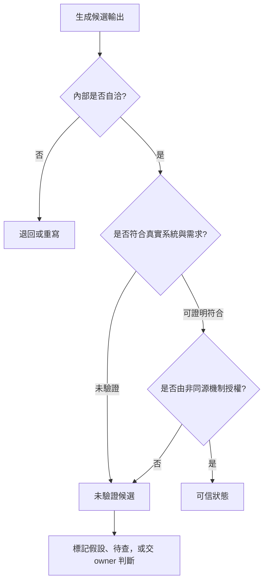
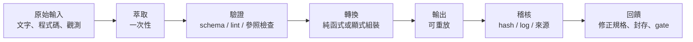

# 誰有資格說「可信」：生成速度超過驗證容量時，非同源裁決與確定性管線的分工

**Structure**: Analytical Essay
**Date**: 2026-10-02T09:10
**Source**: notes
**Model**: GPT-6.1 Sol
**Agent**: GitHub Copilot Chat v0.68.0

## 導言 (Introduction)

設想一個團隊用 agent 完成一個功能：agent 寫規格，依規格寫程式，再寫測試，最後替自己的修改做 review。每一步的輸出都格式完整、語氣專業，測試全綠，review 意見也列得有條有理。團隊按下合併。這是設想，不是事故紀錄，它標出一個常見的形狀：流程上每一道關都過了，但所有關卡的判斷都來自同一個產生內容的來源，沒有任何一關有能力說「不」。

這個形狀不能靠「模型再聰明一點」解決。荒謬的輸出反而好處理：語法錯、測試爆、說法違反常識，防線自然啟動。難處理的是自洽的輸出：它內部說得通，通過局部檢查，但它的語意沒有被驗證，風險沒有被授權，責任沒有落在能承擔後果的人身上。生成的速度提高之後，這種輸出的數量增加，而審查它的人類頻寬沒有增加。

核心問題因此是：在生成速度超過驗證容量時，什麼樣的裁決才能把一份候選輸出變成可信？哪些步驟必須由確定性的機制承擔，哪些可以留給統計生成？以及裁決所需要的材料，例如規格、舊系統的行為與專家的判斷，要從哪裡來？

本文的答案分六步。第一步，把「可信」定義成被授權後的狀態，而不是輸出的屬性。第二步，說明為什麼這在現在成為瓶頸：生成端擴張而驗證端沒有，連驗證者自己的基準也會漂移。第三步，定義什麼樣的裁決者才算數：判準不由被裁決對象的生成過程衍生，並用一個混合模型說明為什麼同源的審查者再多也有下限。第四步，劃出必須由確定性機制承擔的步驟，以及把統計生成接到確定性驗證的管線形狀。第五步，處理棕地專案裡規格能不能當裁決者的問題：先誠實標記，再被守護。第六步，說明非同源的裁決材料從舊系統、專家與生產現場哪裡取得。

適用範圍要先講清楚。本文不處理 agent 的執行權限，也不討論誰該為事故負法律責任。證據分三類：已核對書目的研究（關於語言模型自我修正與自我偏好的兩項研究，以及一項關於獨立開發版本是否獨立失效的實驗）；標明「設想」的情境、數字與模型，只用來示範機制；以及關於特定團隊或工具的一般性敘述，本文沒有公開紀錄可核對，已在行文中標明。沒有任何統計資料支持本文對頻率或規模的判斷。

## 分析 (Analysis)

### 一、可信是被授權後的狀態，不是輸出的屬性

要談裁決，先分開三個判斷。自洽指輸出內部說得通；正確指輸出符合系統的真實狀態與需求；可信指它的正確性有可檢查的證據與授權邊界支撐。自洽不蘊含正確，正確也不自動等於可信：一個碰巧正確的輸出，若沒有任何機制能證明並拒絕錯誤，它仍然只是運氣好的候選。可信不是文字本身的屬性，而是輸出穿過驗證、權責邊界與非同源裁決之後取得的狀態。

下圖把這個狀態寫成一條流程。候選輸出自洽，只能進入「候選」；要成為可信，必須同時滿足兩件事：它對應真實系統，並且由一個能拒絕它的機制授權。



圖裡的 U 是一個容易被忽略的出口：沒被驗證的候選不是壞的，只是不能被當成可信。工作流程的問題常出在把 U 悄悄當成 T。

兩種執行層的分工在這裡就地定義。統計執行層指語言模型：擅長產生候選、展開可能性、找局部缺口與重組材料，但無法保證結果可重現。確定性邊界指測試、型別系統、schema、CI、policy engine 與權限邊界這類機制：在同一輸入下，它們的結果可以重現（測試也可能受時間、隨機性或外部依賴影響，重現性需要被設計出來）。負責的人（owner）不屬於確定性機制：他的判斷不保證同輸入同輸出，他的價值在於可以拒絕、可以授權、並承擔後果。本文把這兩類分開來談：「能否重現」是確定性機制的屬性，「能否拒絕並承擔」是裁決者的屬性，兩者的判準都不由生成過程衍生時，才屬於下文所說的非同源裁決。確定性機制把候選分成可接受、需修改與不可接受；裁決者決定哪些候選可以進入世界。

當這兩層混在一起，會出現閉環自洽：同一個敘事系統生成內容、解釋內容、審查內容、批准內容，最後把授權變成一句專業的「looks good」。有兩項已核對書目的研究顯示這不只是比喻。Huang 等人（2024）檢查大型語言模型在沒有外部回饋時的自我修正（intrinsic self-correction），發現在推理任務上模型難以僅靠自身能力修正回應，有時修正後表現還下降。Panickssery 等人（2024）則發現，語言模型當評估者時會給自己的輸出較高分，即使人類標註者認為品質相當；在微調的實驗中，他們發現這種自我偏好的強度與模型辨識自己輸出的能力呈線性相關。這兩項研究的設定（推理題的自我修正、文字品質的評分）與程式碼審查不同，本文只借它們支持一個謹慎的推論：生成者兼任裁決者時，裁決不會是獨立的證據。

### 二、為什麼這成為瓶頸：生成端擴張，驗證端沒有

人類的驗證容量有認知上限：一位審查者一天能深入理解的規格數量、架構師能有效判斷的設計取捨、QA 能仔細驗收的功能範圍，不保證會隨 AI 加速產出而同步增加。本文假設，AI 加速的是候選產物的生成，不必然同步加速人的理解頻寬（工具也可能提高檢查的吞吐量，這正是下文所說的確定性防線的用途）。規格驅動的流程讓這個不對稱更明顯：一個功能不只產生程式碼，還產生規格、測試、文件、規格與程式碼的一致性檢查，以及多輪修訂。AI 可以一次生成所有層，但每一層都需要驗證。

確定性防線能分擔一部分：lint 與 schema 攔格式、參照與欄位錯誤，編譯器與型別系統拒絕一整類非法狀態，社群與活躍開源專案的審查降低已知錯誤模式。這些防線覆蓋的都是能被規則表達的正確性。剩下的仍然要人判斷：需求是否正確、規格是否描述了真實意圖、設計是否可長期維護、風險是否值得承擔。當生成速度超過這些判斷的容量，未驗證的產物會以格式合規、CI 通過、語氣專業的外觀累積，成為未驗證語意債務。

這種債務不同於傳統的技術債。技術債常有 TODO、workaround 或已知的重構項目，債務本身被標記；未驗證語意債務沒有標記，外觀與已驗證的成果相同。它也更難償還：事後審查已失去原始脈絡，後續變更覆蓋了最初的 diff，當初的意圖已經模糊。

速度陷阱因此不是因為 AI 太差，而是因為 AI 大部分時候夠好。輸出若很爛，防線立刻啟動；輸出若 95% 正確，少量的錯誤就會混入通過流程的產物中。這 5% 的典型形狀是靜默語意偏差：程式在語法上合法、在多數輸入下正確、在審查時外觀無異，卻在特定條件下偏離意圖。它有四個由淺入深的層次：

| 層次 | 例子 | 為什麼審查容易放過 |
| :--- | :--- | :--- |
| 語言的隱式行為 | `input \|\| 10` 在 `input` 為合法的 `0` 時被覆蓋，意圖可能是 `input ?? 10` | 前者是更常見的慣用寫法 |
| 版本與依賴的契約漂移 | 看似相容的函式庫替換（常見的例子是日期函式庫 moment.js 換成 dayjs），解析的寬鬆度可能不同 | 工具能攔「函式不存在」，攔不住「同名 API 在邊界輸入下行為不同」 |
| 設計模式的隱含契約 | `save()` 後發出事件，listener 立刻查詢同一筆資料；「saved」指 ORM flush 還是資料庫 commit，結果會依交易隔離層級而變 | 模式的結構正確，時機契約沒有被寫明 |
| 領域模型漂移 | 折扣、權限、地址驗證在寫下當下正確，業務規則後來變了；agent 參考既有程式碼忠實延續舊假設 | 「與既有做法一致」從可信訊號變成陷阱 |

本文沒有核對 moment.js 與 dayjs 的具體行為，這一列只借它說明契約漂移的形狀。四個層次的共同點是：審查的問題從「這段程式有沒有 bug」變成「這段程式的隱含假設是否仍符合當前脈絡」，而答案往往不在 diff 裡。

還有兩個機制讓驗證者自己的基準也不穩。

第一個是模型漂移。傳統工具鏈升級有明確的版本、變更紀錄與回歸測試；語言模型是核心引擎時，同一份提示、同一組技能與同一份團隊指引，在不同模型版本下可能產生微妙但全面的行為差異。一種常被描述的情境是：一個規格驅動的團隊在底層模型更替後，沒有單一功能壞掉，卻出現分散的漂移：生成的規格多了先前沒有的章節標題，差量同步變得更保守而保留更多舊內容，驗證警告變多，團隊逐漸習慣忽略警告。每個變化單獨看都在容忍範圍內，累積起來品質基準已經下移。這段敘述是未能核對的轉述，沒有公開紀錄可查，本文把它當作機制的設想，不當作證據。這種漂移難以被一般防線攔住：lint 能查格式，查不出「最近的規格讀起來不太一樣」；版本歷史記得檔案的變化，不會標出「從這裡開始是品質滑坡」。鎖定模型版本也不是根治：它爭取了緩衝時間，卻把漸進漂移變成未來某一刻的被迫遷移，而鎖定期間累積的技能與提示調校仍然依賴舊模型的行為。所以可信的工作流程不能預設工具地基穩定，要把模型版本、生成行為、驗證警告率與輸出風格都當成被觀測的對象。

第二個是技能幻覺。偵測漂移需要有人知道什麼是「正常」，但 AI 也可能製造另一種錯覺：人或組織從未具備某項能力，卻因為工具能產出那項能力的外觀，誤以為能力已經存在。這需要三個條件同時成立：工具的輸出看起來像能力的產物，例如格式完整、欄位齊全的 AI 規格與資深工程師手寫的規格在流程系統中難以區分；驗證門檻低於產出門檻，審查只檢查檔案存在、格式正確與欄位齊全，沒有檢查撰寫者是否理解系統行為；回饋延遲夠長，錯誤要到整合測試、生產事故或下一季的需求變更才浮現。它會自我強化：

```text
AI 產出專業外觀
  -> 流程驗證格式通過
  -> 組織記錄為個人能力
  -> 更多任務被分配
  -> 更多 AI 輸出被歸功於人
  -> 錯覺固化為組織信念
```

這條鏈在私有知識的場景尤其危險。設想客服或品保團隊用 agent 分析內部事件紀錄：agent 可以產出根因分類、影響範圍與修復建議，報告像工程分析，但模型並不知道私有的產品架構、錯誤碼語意或生產環境約束，只是用通用模式推測。若使用者也缺少產品理解，就無法分辨「基於理解的正確分析」與「碰巧符合通用模式的推測」。本文推論，這使「人類 owner 最後會判斷」這個許多治理機制的預設變得脆弱：owner 的判斷基準若是被 AI 的外觀餵養出來的，他可能不知道自己不知道。AI 賦能的是使用者已經理解的能力；對尚未建立的能力，它給出的是能力的外觀。

### 三、什麼樣的裁決者才算數：判準不由被裁決對象衍生

第一節的流程圖要求「非同源機制授權」。這裡把它定義清楚：裁決者的判準不從被裁決對象的生成過程衍生，且裁決者有能力拒絕。非同源不是指放在不同檔案、由不同 agent 實例執行，而是指判準的來源：若審查者與生成者共享同一個訓練來源、同一份上下文或同一份被污染的規格，它們的錯誤可能相關；本文推論，這時額外的審查者提供的可能是看起來像獨立證據的重複。這是一個待驗證的假設，不是必然：共享來源不必然導致共同失效。

把這個想法寫成一個最小的混合模型。設一個缺陷要被 $k$ 位審查者檢查。缺陷以機率 $b$ 落在所有審查者共同的盲區，此時所有人都會漏掉；否則（機率 $1-b$），每位審查者各自獨立地以機率 $q$ 漏掉它。則 $k$ 位審查者全部漏掉的機率是：

$$
P_{\text{miss}}(k) = b + (1-b)\,q^{k}
$$

本文推論，這個混合模型是對「同源」的一個簡單設定，不是從資料擬合出來的。它蘊含兩件事：$k$ 增大時，$P_{\text{miss}}$ 在 $0 < q < 1$、$0 \le b < 1$ 時嚴格下降（$q = 0$ 時對 $k \ge 1$ 持平於 $b$，$q = 1$ 時永遠是 1），但永遠不會低於 $b$；而 $b = 0$ 時它回到完全獨立的情形，$q^{k}$ 隨 $k$ 趨近於 0。滿足的設想：審查者各用不同的判準（一位檢查型別，一位檢查需求對照），共同盲區近似為 0。違反（模型所排除的）的設想：審查者全部來自同一個模型，缺陷落在它共同不懂的私有知識裡，$b$ 大，再多的審查者都降不到 $b$ 以下。

Knight 與 Leveson（1986）在〈An experimental evaluation of the assumption of independence in multiversion programming〉中，對「獨立開發的程式版本會獨立失效」這個假設做了實驗檢驗。本文只能確認這篇論文的書目與標題，未讀全文，因此不複述其結果；引用它的目的僅限於說明：獨立開發不蘊含獨立失效，這個假設需要被檢驗，而不能被預設。

下面的模型用精確的分數計算這兩件事，再加入一個判準與審查者無關的檢查（例如型別檢查），它對同一缺陷的漏掉率 $e$ 不受審查者盲區影響。

```python
from fractions import Fraction as F

def miss_rate(k, q, b):
    """k 位審查者全部漏掉同一個缺陷的機率。
    b：缺陷落在所有審查者共同盲區的機率；其餘情形各審查者獨立漏掉的機率為 q。"""
    return b + (1 - b) * q**k

q, b = F(3, 10), F(1, 5)  # 設想的數字，不是估計
rates = [miss_rate(k, q, b) for k in (1, 2, 3, 10, 100)]

assert rates == sorted(rates, reverse=True)   # 多加審查者，漏掉的機率單調下降
assert all(r > b for r in rates)              # 但永遠高於共同盲區 b
assert miss_rate(3, q, F(0)) == q**3          # b = 0 時回到獨立假設

e = F(1, 2)  # 設想：判準獨立的檢查，對同一缺陷的漏掉率
assert miss_rate(10, q, b) * e < b            # 十位同源審查者降不到 b，一個獨立判準可以
```

讀者可以自行執行。要看的是第二與第四條斷言：同源審查者全部漏掉的機率有下限，下限的位置由共同盲區決定，不由人數決定；在本文的設定下，加入一個判準獨立的檢查，可以把聯合漏掉率壓到 $b$ 以下，條件是 $e \cdot P_{\text{miss}}(k) < b$；第四條斷言檢查的是 $e = 1/2$、$k = 10$ 這個設想的數值例。這個「在設定下」很重要：第四條斷言假設獨立檢查的漏掉事件與審查者的漏掉事件統計獨立，且 $e \in [0, 1]$，直接把兩者相乘；「判準不同」並不保證錯誤不相關，若獨立檢查也漏掉同一批難辨的缺陷，乘積會低估聯合漏掉率。模型只檢查它自己設定的規則，也就是混合機率；它不能告訴你 $b$ 在實務上有多大，也不能說明實際的審查者之間有沒有共同盲區，更不能證明獨立檢查與審查者之間的統計獨立。

這個結構解釋了「拓撲補償」（多個 agent、多個模型交叉審查）的有效邊界。多個 agent、多個模型、多個 session 的交叉審查有真實價值，因為不同模型或不同上下文的注意力盲區可能不完全重疊（需依任務驗證）；一個 agent 在生成規格時漏掉併發條件，另一個可能從審查角度提出競態。但這補的是注意力的盲區，不是知識的盲區：若問題涉及私有的產品架構、團隊的特殊約定或未公開的業務規則，所有模型都同樣不知道，猜測不會因為彼此獨立就變成知識。拓撲補償還會增加負擔：一個 agent 生成、一組 agent 審查，人要看的不只原產物，還包括多份意見、彼此矛盾的建議與修改後是否引入新問題；拓撲把「找問題」轉成「仲裁問題」，仲裁者若是人，人的判斷仍是瓶頸，若仲裁者也是 agent，就進入更深的閉環自洽。多 agent 審查因此要在四個條件下才健康：問題在公開或通用知識的範圍；審查維度可預先指定，避免自由發揮製造噪音；人有能力仲裁矛盾；產出量在消化容量之內，過量的意見本身會變成債務。

人在迴路也不自動等於非同源裁決。若人沒有理解能力、沒有權限、沒有時間，或沒有責任承擔，他只是流程裡的一個按鈕。裁決者可以是人、測試、CI、policy engine、權限邊界、型別檢查器、執行期防護、獨立的驗證者，甚至是在乾淨上下文下的獨立重驗；重點不在形式，而在它提供不同於生成敘事的約束來源，並且有能力拒絕。不同的工作需要不同的裁決者：

| 工作 | 候選輸出 | 合適的裁決者 | 它不能被取代的原因 |
| :--- | :--- | :--- | :--- |
| 程式碼審查 | 局部 bug、型別、API 引用、測試缺口的檢查意見 | 負責人（owner）對需求、架構方向、權限模型與風險接受的授權 | 需求是否該存在、抽象是否污染長期架構、快取是否跨租戶，這些問題不在 diff 裡 |
| 知識蒸餾 | 摘要、報告、表格、決策紀錄 | 主題可信度預估、一手資料、人的校驗 | 結構化文字製造權威感，「可能」「待查」進入報告後可能被寫成平滑結論 |
| 長跑 agent | 一連串工具呼叫與修改 | 上下文隔離、工具白名單、高風險操作的確認 | 敘事流暢不等於每一步都被授權 |
| 部署 | 變更集合 | CI、policy、權限邊界、回滾計畫 | 變更是否可逆要由機制保證，不由說明保證 |
| 安全判斷 | 威脅分析 | 威脅模型 owner、實測、獨立審查 | 共享的訓練盲區可能一起漏掉 |

這張表要說明的是：裁決者要跟風險匹配，而且每一列都有一個「不能被取代」的理由。程式碼審查的分工可以寫得更精確：AI 適合掃描引用、型別、局部 bug、測試缺口，產生疑點清單並標出需要 owner 判斷的風險；owner 判斷需求是否合理、架構方向是否可接受、風險是否值得承擔，並授權合併或拒絕。流程若變成 AI 寫、AI 審、AI 批准、AI 合併，審查就從風險控制退化成流暢敘事。

知識蒸餾值得多說一句，因為它看起來最無害。一次探索買到的不只答案，還有分類、排除路徑、反例、未解問題與語彙校準，不回收就要在相似問題重跑一次。但回收的價值不是自動為正：

$$
\text{回收價值} = \text{未來重用價值} - \text{蒸餾成本} - \text{校驗成本} - \text{錯誤固化風險}
$$

這個式子是定性的說法，各項沒有單位也無法被量測；它的用處是提醒：長對話只代表成本已經花掉，不代表內容值得保存，而最後一項，錯誤固化，是結構化版面本身製造的：段落順了、表格齊了、圖有箭頭了，不確定性很容易從版面上消失，讀者感到理解順暢，便誤以為可信度也提高。因此蒸餾要有兩層防禦：先依主題的性質預估可信度（公開、成熟、一手資料密度高的主題可以當學習地圖；封閉、快速變動、私有或高風險的主題只能當假設整理），再對內容各部分懷疑（基礎定義、心智模型、API 細節、安全結論、操作建議與新推論，各自需要不同程度的查證、實驗或 owner 判斷）。漂亮的結構提高的是可讀性，不是可信度。

最後是比例問題：低風險、可逆、可由測試完全覆蓋的工作，不需要同樣厚重的人審。外部裁決要依風險分級，否則會把有限的驗證容量耗在低價值的摩擦上。可信的流程不追求全程順滑，而是在高風險的位置故意留下摩擦：要求證據、要求測試、要求權限、要求 owner、要求重驗。

### 四、哪些步驟必須是確定性的：把統計生成接到可重放的管線

裁決者確定之後，要劃出哪些步驟不能交給統計層。準則是：需要全局一致、可重放、二元判斷或零錯誤的操作，必須由確定性程式、schema 驗證器、linter、CI gate 或執行期斷言執行；模型可以提出假設、整理脈絡與生成候選，但不能成為最後的完整性裁決者。模型能降低錯誤率，不能把它歸零。

違反這條準則的典型形狀是用文字探勘代替結構：腳本反覆用正則表達式從 Markdown 裡猜 YAML、標題、術語與狀態，管線就變成啟發式賭局。決定性管線把這件事改造成可重放的編譯流程：



關鍵是每一層只做一件事。萃取層可以讓語言模型協助整理候選資訊，但結果必須落成結構化的 manifest；驗證層不再反向讀全文猜測，只檢查 manifest 是否符合 schema；轉換層只讀已驗證的輸入；輸出層只負責組裝；稽核層記錄版本、來源與裁決結果。最小的形狀如下：

```python
def run_pipeline(raw_input, schema, code_index):
    manifest = extract_manifest(raw_input)          # 可用 LLM，產出的是假設
    validated = validate_schema(manifest, schema)   # 確定性
    validate_references(validated, code_index)      # 確定性
    output = render_from_manifest(validated)        # 純轉換
    write_once(output)
    append_audit_log(input_hash=hash(raw_input),
                     manifest_hash=hash(validated),
                     output_hash=hash(output))
```

這段偽碼的重點是責任分離，不是語法：語言模型可以參與 `extract_manifest`，但不能跳過 `validate_schema` 與 `validate_references`。輸出不是從原文反覆修補而來，而是從已驗證的資料一次產生，因此同一份輸入與同一份 manifest 會產生同一份輸出，錯誤停在明確的 gate 上。與此相關的還有狀態的位置：若輸出目錄已能代表任務是否完成，再用一份中介 JSON 記錄完成與否，就多了一個真相來源，兩者脫鉤時沒有人知道該相信哪一個；以輸出目錄的實際內容決定任務是否完成，恢復流程就只是重新執行並依現場狀態接續，不必修復一份可能過期的中介紀錄。

確定性的 gate 能守護的，只限於有明確歸屬與可表達形式的東西，這帶出三個結構性要求。

第一，資料、schema、工作流與腳本要有明確的歸屬。agent 讀到一份資料時，若不知道它是狀態、指令、schema、範例還是歷史備忘錄，就會用語言模型最自然的方式處理它：理解、聯想、延伸、補齊，這是污染進入管線的路徑。放在清楚分隔的位置不只是整理目錄，而是告訴 agent：這份 JSON 是狀態，不是寫作素材；這份 schema 是合約，不是建議。各自的責任也要分清楚：工作流指揮執行的順序，不承載資料的真理；腳本是執行者，不是語意的裁決者。這會把自然語言的壓力移出模型的注意力：與其要求 agent「請不要修改這些欄位」，不如只暴露它能填的欄位，並讓保留區由驗證器或腳本拒絕寫入；自然語言的提醒可以輔助，但不能承擔邊界本身。

第二，全局知識要有全局表達。分類規則是典型：當每個種類都各自宣稱「我知道如何判斷自己」，系統表面上物件導向，實際上把優先序、互斥關係與 fallback 藏在註冊順序裡，分類從來不是單一物件的私事，而是整個集合的關係。把它寫成宣告式的分派表（pattern 規則、metadata 守衛與 fallback 排在同一個可稽核的位置），互斥性與優先序就成為資料，能被腳本檢查，agent 也不必從分散的檔案與註冊順序推測真相。

第三，領域邊界要壓縮 agent 的搜尋空間。排程器若同時解析設定、改寫物件、更新狀態、補標籤，agent 要理解一次修改，就得閱讀大量不相干的路徑與副作用。把「如何形成合法物件」封裝進領域元件，agent 就沿著顯式介面理解狀態如何形成：

```python
# 副作用散落：排程器成為神物件
def publish(document, context):
    document.meta["author"] = parse_author()
    document.meta["tags"] = infer_tags(context)
    document.body = patch_terms(document.body)
    document.meta["telemetry"] = read_runtime()
    write(document)

# 變更入口固定在組裝器
document = (
    DocumentAssembler(base)
    .with_author(config)
    .with_tags(vocabulary)
    .with_body_transform(term_policy)
    .with_telemetry(runtime)
    .build()
)
publisher.emit(document)
```

這個差別不只是美觀。前者的狀態可能在途中被暗中改寫，後者把變更入口固定在組裝器，每一步能被測試、替換與稽核；這與第二節的審查負擔也相關：可稽核的結構讓確定性檢查有地方附著。

### 五、棕地專案裡，規格要能裁決，必須先誠實，再被守護

規格是最常被請來當裁決者的材料：它定義什麼算完成。但在已經運作的棕地專案裡，規格不是起點，而是尚待建立的東西，直接宣稱它已經是權威，會讓不可信的文字取得權威的外殼。

起點是承認規格債：系統中已經實作、卻尚未被明確規格定義的行為。它不代表系統錯了，而代表「正確」尚未被寫成可驗證的契約；技術債是程式碼品質或設計的妥協，規格債是驗證風險，行為只存在於程式碼中時，任何修改都只能依賴維護者或 agent 對現有實作的理解。這個債務不能用「先補完所有規格」清償，因為一次性補規格很容易退化成用自然語言抄寫程式碼，或把尚未確認的推測寫成設計意圖。可行的路徑是增量形式化：每次功能開發或修復接觸到某段行為時，把新理解的現況與意圖放到正確位置。判斷標準不是全專案的規格覆蓋率，而是「本次被修改的具體行為是否已有契約」。

主要的危險是把觀察誤升格為契約。逆向工程得到的是「系統現在如何運作」，規格契約描述的是「系統應該如何運作」；兩者可以寫在同一份檔案，但必須在不同的結構位置，用不同的語言，承擔不同的權威。

| 概念 | 回答的問題 | 權威 | 去向 |
| :--- | :--- | :--- | :--- |
| 觀察性 schema | 現況、缺陷、衝突與未確認的行為 | 可被程式碼推翻的描述 | 描述層 |
| 約束性規格 | 已審查、應被保護的行為 | 程式碼必須遵守 | 契約層，以可驗證場景（Given / When / Then）與 MUST、SHOULD、MAY 表達 |
| 願景 | 未來希望系統具備的能力 | 沒有，不得被當成已存在 | 明確標記為 planned |
| 衝突 | 文件、程式碼、規格或歷史互相矛盾 | 沒有 | 轉為可追蹤的工作項，不藏在 schema 裡 |

```yaml
# 觀察性 schema：收容現況與願景，不宣稱已成契約
UserExport:
  observed_format: "comma-separated string"
  x-status: "observed"
  x-conflict: "legacy document claims array payload"
  planned_payload:
    x-status: "planned-vision"
    note: "Do not assume this exists at runtime."
```

```yaml
# 約束性規格：已確認並應被 gate 保護
UserExport:
  required:
    - user_id
  properties:
    user_id:
      type: string
      pattern: "^[a-z0-9_]+$"
  x-contract: "runtime and CI MUST reject payloads without user_id"
```

差別看似格式，實際是權威邊界：觀察性 schema 的目的是讓混亂可見，不是命令系統；約束性規格的目的是定義系統必須遵守的行為。畢業不是定期的審計儀式，而是在實作接觸時發生：當某段行為要被修改、保護或被外部依賴時，團隊才有足夠的語境判斷它是否應該升格。

規格能裁決，還需要第二個條件：它被確定性的機制守護。命名規則若只存在於文件，agent 仍可能生成 `userName`、`user_name`、`buyer_id` 這些同義變體；schema 若不接入型別檢查、執行期驗證、pre-commit hook 或 CI gate，只是結構化的註解。這回到第四節的準則：檢查規格 ID 是否存在、欄位是否合規、跨文件引用是否孤立，都是全局一致或二元判斷，應由腳本執行；語言模型可以幫忙解釋為什麼某段行為該成為契約、草擬差量提案、整理衝突脈絡，但最後的完整性檢查交給確定性機制。本文推論的結論是：沒有 gate 的規格只是高成本的文件。

規格與程式碼互相約束之後，問題從「如何建立規格」轉向「如何運營規格」。回滾不再只是沿著版本控制往回走：程式碼可以 revert，但規格之間的引用、下游工作與歷史語意不一定能同步反轉，對一個人是恢復的操作，可能是另一個人的引用斷裂。封存（archive）承認一致性是暫態，歷史需要可溯源，舊版本被封存為演化軌跡，漂移就不被當成孤立的 bug；但封存不是調和（reconciliation）：它不自動更新跨規格的引用，不判斷現在應採用哪個契約，也不消除漂移偵測的需求。因此治理本身需要被觀測，這與第二節的模型漂移是同一件事，只是對象換成治理機制：

| 層次 | 可觀測的問題 | 適合的方式 |
| :--- | :--- | :--- |
| 規則遵守率 | gate 被繞過幾次、孤立引用被攔截幾次、規格與程式碼的差異有多少 | 確定性的統計與儀表板 |
| 規則有效性 | 被攔截的問題是否真有風險、漂移多久才被發現、恢復成本是否上升 | 半自動整理加人判斷 |
| 治理摩擦成本 | 團隊是否為了合規產生空洞的產物、流程是否拖慢交付 | 人主導，語言模型可輔助摘要 |

規則不是寫完就永遠正確，摩擦高於收益時要能退役或降級。同樣的態度也用在引入外部的規格驅動框架：本文把此類框架的價值整理為三個思維模型，規格作為行為的真相來源、差量變更作為一等公民、結構位置承載語意（常見的做法以 `specs/`、`changes/`、`archive/` 這類目錄為例）。但棕地專案通常已有自己的治理、技能、lint、CI 與文件路由；框架的命令列工具若與既有工具鏈並行操作同一批規格而不共享狀態，就製造兩條互不知情的寫入路徑，這時較好的選擇可能是概念級採納：保留目錄語意、差量流程與契約格式，由既有工具鏈負責操作。有些治理機制只為過渡期存在，例如保護舊知識庫遷移的層級規則；當被治理的對象消失、依賴圖指向已完成的任務、移除後功能沒有退化，它就是鷹架而不是基礎設施，不能退役的鷹架會把舊防線變成新的摩擦。本文沒有查核任何特定框架的實際行為，這裡是對此類框架的一般性整理，不是對任何特定工具的描述。

### 六、非同源的裁決材料從哪裡來：舊系統、專家與生產現場

裁決需要材料：什麼算正確的參考。取得這些材料的時候，最容易重新引入同源。

重寫或大型重構是最明顯的場合。舊程式碼、舊測試、舊 bug、原作者的原型與團隊習慣，會把新系統拉回舊世界，而 AI 擅長模仿上下文，若上下文主要是舊程式碼，模型會把舊的形狀當成權威。錯誤的路徑有幾種：逐行翻譯，把舊語言的隱式狀態搬進新語言，用全域鎖、singleton 或共享可變狀態包裝成「相容」；白盒測試搬運，把私有方法、mock 結構與中間狀態誤當成契約；追求 bug 相容，把歷史的偶然永久化；原作者的原型把壓縮過的直覺以未解釋的形狀交給 AI，成為新的定錨污染。用本文第三節的語言說，舊測試是從舊程式碼的實作衍生出來的判準，拿它當新系統的裁決者就是同源。

正確方向是黑盒考古：舊程式碼是證據，不是藍圖；舊測試是線索，不是法律；原作者的直覺是高價值的材料，但要被解壓成因果鏈。重寫前要先問：

| 問題 | 目的 |
| :--- | :--- |
| 系統對外承諾了什麼？ | 萃取真正的業務契約 |
| 哪些輸入導致哪些狀態轉移？ | 建立可測試的狀態機 |
| 哪些錯誤語意被呼叫端依賴？ | 保留外部相容性 |
| 哪些 bug 已被下游依賴？ | 設計相容層與退場條件 |
| 哪些歷史補丁在防禦事故？ | 避免清掉必要的邊界 |
| 哪些形狀只是舊框架的遺產？ | 允許新語言使用新範式 |

專家的知識往往不是文件形態，而是壓縮的直覺。專家說「不要加鎖」，背後可能是熱路徑等待外部 API、工作者被耗盡、訊息重送、自我放大的故障迴圈；AI 聽到的只是「不要用 mutex」，於是改成 actor、channel 或非同步佇列，保留同樣的物理瓶頸。逆向解壓縮利用這個問題：先讓 AI 產生一份明確標記為候選假設的天真方案，再請專家攻擊它。專家看見具體的錯誤，比從零口述整個系統容易，每一句「這裡會壞，因為……」都把壓縮的直覺展開成因果。這個流程必須受控：錯誤的初稿不能進程式碼庫，不能用權威的語氣，也不能當成建議實作；專家的反駁要被轉成結構化條目（錯誤設計、失敗原因、觸發條件、保留約束、驗證方式），只有沉澱成規格、封存紀錄或測試，AI 的錯誤才轉化為治理資產。這也讓審查的焦點前移：與其先讓 AI 產生大量錯誤程式碼再請資深工程師逐行修補，不如先審查候選設計的失敗語意；規格穩定後，實作審查才檢查程式碼是否忠於契約。本文推論，這個流程的價值在於專家是非同源的裁決者，AI 的錯誤只是讓他的反駁變得具體的探針；沒有找到它的實證評估。

最後，真相來源本身要多維化。傳統的單一真相來源（SSOT）常被理解為「唯一的資料來源」，但在 AI 協作中，不同的來源回答不同的問題，衝突時要先判斷是誰該讓步：

| 來源 | 回答的問題 | 與它衝突時要問什麼 |
| :--- | :--- | :--- |
| 程式碼庫 | 現在實際做什麼（物理現實） | 與規格衝突：是實作漂移，還是意圖過期？ |
| 現行規格 | 應該是什麼（意圖） | 與生產現場衝突：是假設錯誤，還是系統需要補強？ |
| 封存 | 為什麼不能那樣做（歷史因果） | 程式碼重新引入封存記錄過的危險模式：要求說明這次條件為何不同 |
| 生產現場 | 現實如何回饋（指標、紀錄、追蹤、事故、使用者行為） | 反駁紙上假設；需要被解釋，不會自動等於對 |

這張表要說明的是：每個來源都可能是真的但不完整，程式碼庫可能真實卻已被污染，規格可能正確卻已過期，封存有因果卻不等於當前的契約，生產現場反映現實卻需要解釋；成熟的治理不是消除這些張力，而是讓張力有固定的對話位置。其中生產現場特別重要，因為它提供的觀測不同於規格的敘述，是第三節意義上最強的非同源來源之一；它也有測量偏差：哪些項目被量測、如何取樣、儀表板顯示什麼，仍由團隊選擇，沒被量測的事件不會出現在資料裡。

## 反思 (Reflection)

**五種常見的誤用。** 把自洽當成可信：一份報告或審查可以非常流暢，卻只是把未驗證的推論排列得更好，流暢是閱讀品質，不是驗證結果。把「確定性工具通過」當成語意正確：型別、lint、schema 與 CI 能攔住可形式化的錯誤，業務邏輯、領域漂移、設計取捨與風險承擔仍需 owner。把「多 agent 同意」當成外部裁決：多個模型可能共享訓練盲區與不知道的私有脈絡，同源的共識不是證據。把「人在迴路中」當成安全保證：人若沒有理解、權限、時間與責任，只是流程中的按鈕。把所有工作都升級成重裁決：低風險、可逆的工作用同樣厚重的流程，會把驗證容量耗在低價值的摩擦上。

**誠實與收斂之間有張力。** 若只追求誠實，團隊可能永遠停在觀察性 schema，什麼都不敢升格；若只追求收斂，又會把未確認的行為快速包裝成規格，重新製造虛假權威。雙層結構把這個張力顯性化：觀察層允許說「我只知道系統現在這樣做」，契約層要求說「我們同意系統應該這樣做」。

**治理的意願不是治理的能力。** 文件可以宣稱某個命名不可違反，只有編譯、lint、schema 驗證或執行期檢查能阻止違反；提示可以提醒 agent 不要帶入過時的引用，只有參照完整性的腳本能穩定阻止孤立引用進入系統。規格的成熟因此不是數量增加，而是權威鏈變短、邊界變清楚、漂移變可觀測：規格越多而 gate 越弱，只增加文件漂移的面積。

**確定性邊界有自己的失效。** 確定性機制只守護能被形式化的東西；它通過不代表語意正確，而且它的判準若也由生成者撰寫（例如由同一個 agent 寫的測試），就退回第三節的同源。本文沒有給出一個普遍的方法來區分「判準獨立」與「判準看似獨立」，只能逐案追問判準從哪裡來。

**本文的證據限制。** 第一，三項外部研究的設定（推理題、文字評分、獨立開發的程式版本）與程式碼審查或規格治理不同，只支持方向性的推論；Knight 與 Leveson 的實驗結果本文未能讀取。第二，混合模型與其中的數字是設定與設想，不是估計；$b$ 的大小無從從本文得知。第三，關於特定團隊的模型漂移經驗、日期函式庫的行為與規格框架的設計，沒有公開紀錄可核對。第四，蒸餾回收價值的式子、逆向解壓縮的流程與「非同源」的定義，是本文整理的框架，沒有經過實證檢驗。

## 實務對比 (Practical Contrastive Examples)

下表對照兩種做法在同一個場景下的差別。它要檢查的是：授權由誰給、判準從哪裡來、錯誤停在哪裡。

| 場景 | 同源的做法 | 非同源裁決的做法 | 差異出在哪 |
| :--- | :--- | :--- | :--- |
| 合併前的審查 | agent 寫程式、agent 審查、多個 agent 同意後合併 | agent 提出疑點清單，owner 對需求、架構與風險授權，型別與測試作為獨立的 gate | 授權是否由能拒絕的非同源機制給出 |
| 保存探索的結果 | 把長對話整理成漂亮的報告，視為已驗證的知識 | 依主題預估可信度，對定義、API 細節、安全結論分別查證，未驗證的標為假設 | 結構是否被當成可信度 |
| 重寫舊系統 | 逐行翻譯，搬運舊的白盒測試當驗收標準 | 先萃取黑盒契約，舊測試當線索，專家攻擊候選方案以展開直覺 | 判準是否從被取代的實作衍生 |
| 規格治理 | 把現況與願景寫成同一份「規格」，宣稱單一真相 | 觀察層與契約層分開，契約由 gate 守護，並觀測治理本身是否有效 | 規格是否誠實，並且被確定性機制守護 |

四列的共通點是：差別不在於做了多少檢查，而在於檢查的判準有沒有一部分來自生成過程之外。

## 結論 (Conclusion)

生成速度超過驗證容量之後，可信不能再靠「看起來對」取得。它是一種被授權的狀態：候選輸出要通過一個判準不由生成過程衍生、並且有能力拒絕它的裁決。同源的審查者再多，下限由共同盲區決定，不由人數決定；因此問題不是審查者夠不夠多，而是判準從哪裡來。

這帶出四個可帶走的原則。第一，自洽不是正確，正確不是可信，可信是被授權後的狀態。第二，需要全局一致、可重放、二元判斷或零錯誤的步驟，交給確定性機制；語言模型產生候選與假設，不做最後的完整性裁決。第三，規格要能裁決，必須先誠實標記觀察、契約、願景與衝突，再被 gate 守護，並且治理本身也要被觀測。第四，裁決的材料要找非同源的來源：舊測試只是線索，專家的反駁、黑盒契約與生產現場才提供不由團隊自己敘事衍生的約束。

自動化的價值在於提高候選的密度；治理的價值在於決定哪些候選可以進入世界。

## 參考文獻 (References)

- Huang, J., Chen, X., Mishra, S., Zheng, H. S., Yu, A. W., Song, X., & Zhou, D. (2024). Large language models cannot self-correct reasoning yet. *ICLR 2024*. [arXiv:2310.01798v2](https://arxiv.org/abs/2310.01798v2)。本文依 arXiv 摘要，未讀全文。引用範圍：不借助外部回饋的自我修正在推理任務上有困難，有時修正後表現反而下降。
- Knight, J. C., & Leveson, N. G. (1986). An experimental evaluation of the assumption of independence in multiversion programming. *IEEE Transactions on Software Engineering, SE-12*(1), 96–109. [https://doi.org/10.1109/TSE.1986.6312924](https://doi.org/10.1109/TSE.1986.6312924)。書目已由 Crossref 紀錄核對；未能讀取全文，引用範圍僅限於論文標題所表明的研究問題，不引用其結果與數字。
- Panickssery, A., Bowman, S. R., & Feng, S. (2024). LLM evaluators recognize and favor their own generations. [arXiv:2404.13076v1](https://arxiv.org/abs/2404.13076v1)。本文依 arXiv 摘要，未讀全文。引用範圍：語言模型評估者給自己的輸出較高分，且自我辨識能力與自我偏好的強度呈線性相關。
