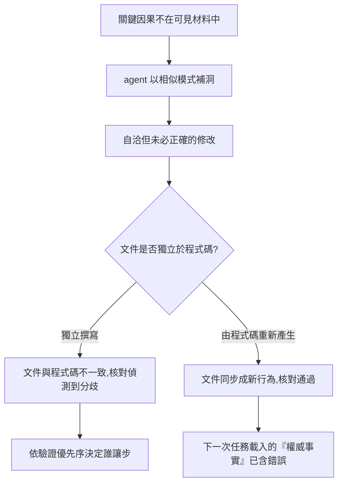

# 權威落在哪裡：Agent 只能依據載入的材料行動時，誰裁決分歧，錯誤又如何被固化

**Structure**: Analytical Essay
**Date**: 2026-10-02T07:50
**Source**: notes
**Model**: GPT-6.1 Sol
**Agent**: GitHub Copilot Chat v0.68.0

## 導言 (Introduction)

設想一位開發者請 agent 調整取消訂單的規則。agent 打開的檔案裡只有一行 `order.isCancellable()`；專案文件寫著「取消流程由訂單服務處理」，另一份舊筆記則說已出貨的訂單也可以取消。agent 改完，測試通過，順手把新行為補進文件。三週後，已出貨的訂單被錯誤取消。這是設想，不是事故紀錄，它標出一種形狀：沒有人明顯犯錯，每一步都有看得見的依據，但依據彼此不同，而 agent 沒有辦法問出哪一份才算數。

直覺的對策是把 agent 當成一位偶爾失誤的開發者：提示寫得更精確、換更強的模型、多一輪審查。這些做法預設錯誤來自粗心或能力不足。本文檢查另一個預設：在一次任務中，agent 的行動依據是載入的指令、檔案片段與工具輸出；專案專屬的因果若不在其中，就不參與決策，也不能假設 agent 會自發追問自己缺了什麼。如果這個預設成立，工程系統裡「哪一份材料算數」就成了設計問題，而不是 agent 的判斷問題。

核心問題因此是三個連在一起的問題。分歧發生時，由哪一份材料裁決？那份材料憑什麼配得上裁決權？而錯誤要怎麼進入這些材料，又怎麼從一次暫時的誤判，變成下一次任務裡的「事實」？

本文的答案分六步。第一步說明什麼東西不在 agent 眼前，以及它如何補洞。第二步把「誰裁決」當成驅動模型（Driving Model）來分析：每一種裁決媒介都有它能保證與不能保證的範圍。第三步說明權威必須可被驗證，並且不能由它下游的材料重新產生，否則核對會失去鑑別力，錯誤會被洗成事實。第四步處理材料放在哪裡：只外化推導不出的知識，其餘委託給既有權威，並讓入口只負責導航。第五步給出何時值得多加一層權威的成本判準。第六步回到同一權威之下，說明怎樣縮小 agent 必須猜測的空間。

適用範圍要先講清楚。本文不處理 agent 的執行權限，也不處理提交前檢查流程的設計。證據分三類：公開的論文與文件（Nygard 的架構決策紀錄、兩篇關於語言模型如何使用上下文的研究、AGENTS.md 格式文件）；標明「設想」的情境與數字，只用來示範機制；以及本文推論，已在行文中標出。沒有對應的事故調查或統計資料支持本文任何一項頻率或規模判斷。

## 分析 (Analysis)

### 一、Agent 看不見的東西不參與決策，而它會補洞

agent 在單次任務中的工作狀態可以簡化為：載入指令、檔案片段與工具輸出，在這些可見內容上產生下一步，再根據結果繼續。專案專屬的因果若沒有出現在可見內容裡，就沒有機會被考慮。這不是缺陷的指控，而是邊界：同一個決定，擁有跨年記憶與主動懷疑習慣的人類，常能靠經驗補上缺口，agent 不能預設有這種補救。

這裡要分開三個判斷。自洽（coherent）指輸出內部看起來不矛盾；正確指輸出符合系統真實狀態與需求；可信指它的正確性有可檢查的證據與授權邊界支撐。自洽不蘊含正確，正確也不自動等於可信。agent 可以依據可見內容寫出流暢、結構完整的修改，缺口則用相似模式補成合理的敘事。這種敘事有時剛好正確，有時穩定地錯，兩者在文字表面上不一定能分辨。

因果斷裂（Causal Breakpoint）指系統要求 agent 做決策，但產生該決策所需的因果鏈沒有在可見材料中連續存在。依缺口的成因可以分成三種：

| 型態 | 缺口怎麼來 | 例子 | 留下的線索 |
| :--- | :--- | :--- | :--- |
| 曾經存在，但被刪除 | 封裝與去重複把局部的理由收進遠端的抽象 | 取消條件被收進 `isCancellable()` | 函式名、型別或介面 |
| 從未存在 | 關係在執行期才成立，靜態文本裡沒有 | 事件訂閱、動態分派、非同步期間的狀態改變 | 沒有，agent 不知道要找什麼 |
| 錯誤存在 | 過期的文件、錯誤的摘要或被污染後回寫的規格，以權威的語氣出現 | 已被改動的流程仍寫著舊說明 | 看起來完全可信 |

用取消訂單說明第一型的形狀。下面兩個版本做同一件事，差別在於「為什麼已出貨的訂單不走這裡」寫在哪裡：

```javascript
// 版本一：因果就在決策點旁邊
function processOrder(order) {
  // 只有 pending 且未出貨的訂單可取消。
  // 已出貨訂單走退貨流程，不走取消流程。
  if (order.status === "pending" && !order.shipped) {
    cancelOrder(order);
  }
}

// 版本二：對人類較整潔，但 why-not 被收進別處
function processOrder(order) {
  if (order.isCancellable()) {
    cancelOrder(order);
  }
}
```

人類眼中，版本二更乾淨。問題不在封裝本身，而在封裝的用途就是讓呼叫者不必知道內部條件，因此排除退貨流程的理由被移到 agent 未必會讀到的地方。後續要求修改取消規則時，agent 看見的是 `isCancellable()` 這個結果，不是它背後的排除理由；它很可能做出局部合理、全域錯誤的改動。

Nygard（2011）在〈Documenting Architecture Decisions〉中描述了人類新成員遇到同樣處境時的選擇：看不懂過去某個決定的動機與後果，只有兩條路，盲目接受，或盲目更改；前者在脈絡已變時有害，累積太多會讓團隊不敢改動任何東西，後者可能在不知情下損害專案價值。本文推論，agent 面對只有結果、沒有理由的程式碼時處境相同，只是它不能被假設會像人類新成員那樣去問人或翻舊紀錄。這是類推：Nygard 的文章寫的是人類團隊，沒有討論 agent。

三種斷裂的危險程度不同。本文推論，刪除型至少留下一條可追的線索，從未存在型讓 agent 不知道該找什麼，錯誤存在型最危險，因為它不是缺口，而是帶著可信外觀的錯誤輸入，agent 沒有理由懷疑它。這個排序是推論，不是測量；它的用處是指出下一步要問什麼：既然錯誤的材料會以權威的外觀進入決策，就必須先問，哪些材料有權威。

### 二、分歧時誰被服從：驅動模型與它的能力邊界

驅動模型（Driving Model）描述的是專案的決策權威（Decision Authority）分配方式：當團隊對「這個行為是否正確」產生分歧，最後會查閱什麼，並讓什麼推翻其他說法。它不是工具分類，也不是文件格式分類。判斷一個模組由什麼驅動，不看文件是否存在，而看分歧時誰被服從：團隊說「我們有測試」，不等於測試持有決策權威；說「我們有規格」，也不等於規格真的能推翻程式碼。

每一種媒介都有能力邊界（Capability Boundary）：它能穩定保證什麼，以及不能保證什麼。下表以設想的退款爭議說明：團隊在爭論「是否允許超過 30 天的訂單退款」。

| 媒介 | 爭議時查什麼（設想） | 能保證 | 不能保證 | 越界時的失敗 |
| :--- | :--- | :--- | :--- | :--- |
| 程式碼驅動 | `refund()` 現有的分支 | 系統可運行，真相來源單一 | 行為符合意圖 | 把「能跑」當「正確」，行為偶然化 |
| 測試驅動 | 退款測試案例 | 已表達的預期可驗證、可回歸 | 預期本身是對的 | 把「測試通過」當「意圖正確」 |
| 技能驅動 | 退款操作手冊的步驟 | 操作流程一致 | 流程的目標正確 | 流程儀式化（Process Ritualization） |
| 準則驅動 | 錯誤處理、稽核與隱私準則 | 品質下限與審查依據 | 品質方向對齊業務需求 | 品質空轉 |
| 規格驅動 | 規格中「30 天外退款需主管核准」的場景 | 行為契約明確 | 規格仍反映真實需求 | 規格與現實脫節 |

這張表要檢查的是：同一個爭議在不同媒介下得到的答案類型不同，而且每種媒介被追問它回答不了的問題時就失敗。把測試寫得再完整，也不能自動回答 30 天外退款是否符合政策；把規格寫得再清楚，也不能保證程式碼符合安全準則。失敗不是媒介本身無用，而是它的權威被延伸到能力邊界之外。

程式碼驅動值得單獨展開，因為它是最常見的起點，也最容易被輕視。它有真實價值：沒有抽象開銷、真相來源單一、迭代最短，對原型與低風險模組可能正是最合理的選擇。它的極限同樣清楚：程式碼記錄「做什麼」與「怎麼做」，不可靠地記錄「為什麼」與「什麼時候算完成」。原作者離開、記憶消退、或系統規模超過團隊的認知容量後，行為就從「被理解的設計」變成「碰巧存在的狀態」。後來的人看到一個特殊分支，無法判斷它是設計意圖、歷史偶然，還是某個 bug 的副作用；把偶然的副作用當成預期的意圖並據此決策，就是行為偶然化（Behavioral Accidentalization）。它的徵兆是社會性的：新成員上手變慢，審查留下「不確定會不會影響 X」，修改前要先找人問歷史。Nygard（2011）描述的「團隊變得不敢改動任何東西」與這些徵兆吻合，本文推論兩者是同一個現象的不同觀察面，這個對應沒有被任何研究檢驗過。

測試驅動需要另外拆開，因為它最容易被放錯位置。測試回答的是「行為是否可驗證」，不回答「流程由哪種權威裁決」，因此它與流程成熟度是兩條獨立的軸：程式碼驅動的專案可以有大量測試來保護既有行為，規格驅動的專案也可能暫時缺少自動化測試。有測試也不代表意圖來源的問題已解決；測試若沒有上游的意圖，只能穩定地保護「已經被寫成測試的行為」，連同其中的偶然。

排除測試之後，另外四種媒介可以理解為一條由下往上疊加的軸：程式碼回答現在做什麼，技能回答下一步怎麼做，準則回答怎樣算做得好，規格回答什麼算做完。每一層補上前一層沒有的語義。疊加的方式是層疊共存（Layered Coexistence）：新媒介取得更高層的決策權威，舊媒介降格為基礎設施，繼續運作，而不是被取代。規格驅動的專案仍然需要準則、技能與程式碼；拿掉底層，頂層不會獨立運作。代價是每多一層就多一份需要維護的權威材料。

### 三、權威必須可驗證，且不能由下游材料重新產生

知道誰有權威還不夠，還要知道衝突時憑什麼相信它。治理文件常宣稱自己對齊某個外部權威（官方文件、工具原生 schema、lint 預設），但宣稱對齊與實際對齊是兩回事：官方文字可能落後於執行期，範例可能停留在舊版本，front matter 與註解可能殘留舊術語，計畫中的整合可能被寫成已完成。

**驗證優先序**

驗證優先序（Verification Precedence）把「相信誰」寫成一條可操作的順序：能在執行期驗證的，以 schema 驗證器、測試、lint 與工具的實際行為為準；無法執行驗證但能讀取原始碼或機器可解析設定的，以它們為準；只剩文件時，使用文件，但標記為描述性來源。這個順序的依據是它們與系統實際接受的行為之間的距離，不是誰比較權威的名分：文件是對行為的描述，描述可以落後於行為；但實際行為只是「現況如何」（as-built）的證據，不保證意圖正確，意圖要回到契約與負責人判斷。同一個原則在專案內部也成立：在確認現況（系統實際做什麼）時，程式碼行為高於就近的文件，就近的文件高於歷史知識庫；在判斷應然（系統該做什麼）時，已成為有效契約的規格高於描述性的考古筆記。沒有這條順序時，「以原生定義為準」只是信任假設；有了它，才是可操作的規則。

兩個限制要寫明。第一，順序只在驗證實際可執行時才有意義，可以執行的檢查才有資格優先。第二，兩份材料不一致只告訴你至少有一份是錯的，不告訴你是哪一份；優先序決定的是在不一致發生之後由誰讓步，偵測不一致需要另一個機制，本節稍後說明它何時失效。

**只傳結論的矯正會流失邊界**

人類對 agent 的矯正常常只傳遞結論，不傳遞推理。設想一次協作中，人說「這次先跳過考古」，因為目標元件沒有歷史對應物，這在當次完全合理；但如果只留下「可以跳過考古」這個模式，下一次 agent 可能把例外當規則。規則被記住了，規則成立的邊界消失了。

文件中的矯正同樣如此。設想某份文件曾錯稱某元件透過子行程切換權限，後來只把文字改成正確的結論，沒有記錄「它其實在同一行程內完成，沒有 fork，也沒有中間行程」這條因果；下一個協作者仍可能在相鄰的問題上重建同樣的錯誤模型。只保存結論讓文件更乾淨，也更脆弱；保存推理鏈，agent 才有機會處理作者沒有事先列舉的邊界案例。這兩個例子是設想，用來說明保存「為什麼」比保存「是什麼」多承擔了什麼。

**自動回寫如何把暫時的錯誤洗成事實**

更嚴重的失效出現在回寫。agent 依據過期知識改壞共享程式碼，同步流程再把新的壞行為寫回文件。下一個 session 載入的不是「前一次可能犯錯」，而是一份乾淨、完整、語氣肯定的背景知識。錯誤不再像錯誤，而像系統現況。



這張圖的關鍵在決策點：回寫本身不是問題，問題是文件的內容是否由被核對的對象衍生。可以用一個形式陳述把它說清楚。設程式碼可能的取值構成集合 $U$，需求是其中一個指定的值 $r \in U$，文件的內容是 $d$。定義核對 $\mathrm{agrees}(c, d)$：當程式碼取值 $c$ 與文件內容 $d$ 相同時為真。

- 若文件獨立於程式碼，且內容與需求一致，即 $d = r$，則 $\mathrm{agrees}(c, d)$ 為真，當且僅當 $c = r$；核對能分辨錯誤的程式碼。
- 若文件由程式碼衍生，$d = c$，則對任何 $c \in U$，$\mathrm{agrees}(c, d)$ 都為真；核對對任何錯誤都沒有鑑別力。

注意第一條有兩個條件：獨立，而且與需求一致。獨立本身不保證正確，一份獨立但過期或寫錯的文件，會在程式碼正確時誤報不一致；本文的陳述只說明衍生關係會使核對失去鑑別力，不說明獨立文件一定可靠。滿足陳述的例子：文件由人依需求寫成，程式碼被改成「出貨後也可取消」，核對立即不一致。違反的例子（也就是陳述所排除的）：同步流程把文件重寫成「出貨後也可取消」，核對通過，錯誤仍在。這個陳述不需要經驗支持，它是定義的後果；需要經驗檢驗的，是實際專案裡有多少文件屬於哪一種，本文沒有這份資料。

下面的模型把上面兩種情形放進同一個小宇宙：程式碼是「允許取消的訂單狀態」集合，需求是只允許 `pending`。它列舉所有可能的程式碼取值，比較獨立文件與衍生文件的核對結果。

```python
from itertools import chain, combinations

STATUSES = ("pending", "shipped", "delivered")
REQUIREMENT = frozenset({"pending"})  # 需求：只有 pending 訂單可取消

def all_subsets(xs):
    return [frozenset(c) for c in chain.from_iterable(
        combinations(xs, n) for n in range(len(xs) + 1))]

def agrees(code, doc):
    return code == doc

def derived_doc(code):
    return code  # 同步流程：文件由目前的程式碼重新產生

independent_doc = REQUIREMENT  # 設定：文件由人依需求撰寫且與需求一致，不隨程式碼重算

faulty = [c for c in all_subsets(STATUSES) if c != REQUIREMENT]
assert len(faulty) == 7  # 2**3 種取值，扣掉正確的那一種

for code in faulty:
    assert not agrees(code, independent_doc)  # 獨立文件對每一種錯誤都不一致
    assert agrees(code, derived_doc(code))    # 衍生文件對每一種錯誤都一致

assert agrees(REQUIREMENT, independent_doc)
assert agrees(REQUIREMENT, derived_doc(REQUIREMENT))
```

模型的核心斷言是迴圈裡的兩行：同一組七個錯誤取值，獨立文件全部被分辨出來，衍生文件一個也沒有。讀者可以自行執行確認；它檢查的只有本文設定的規則，也就是「核對」只比較兩者是否相等。它不能告訴你實際團隊中的文件由誰產生，也不涵蓋文件獨立但自己過期的情形：那時核對會誤報不一致，仍需要由驗證優先序決定誰讓步。

這個結構也解釋了為什麼把「判斷獨立性」的依據放在文件的衍生關係上，而不是文件的位置或名稱：「文件」與「程式碼」放在不同檔案，不代表它們獨立；只要其中一份由另一份重新產生，核對對上游的錯誤就沒有鑑別力。

### 四、把材料放在能被正確消費、也能退場的位置

權威確定之後，下一個問題是知識放哪裡。失效通常不是因為文件太少，而是因為不同性質的知識被放進同一個容器：入口檔膨脹成百科，個人記憶複製了會變動的程式碼結構，治理文件重述外部工具已經定義的規則，知識庫保存早該被程式碼或規格吸收的考古筆記。表面上都是「增加上下文」，實際上是權威漂移（Authority Drift）、注意力污染與維護債務。

**只外化推導不出的知識**

能從程式碼推導的事實，若被複製進集中的知識庫，就多了一個會過期的入口，並和第三節的回寫問題連在一起。知識庫該保存的是程式碼推導不出的因果：被排除的方案、歷史約束、跨模組的依賴方向、外部整合的限制。能由程式碼與測試承載的事實，就交給它們，避免製造第二個會漂移的真相來源。

Nygard（2011）提出的架構決策紀錄（architecture decision record, ADR）是這類知識的一個現成格式：一份短文字檔，包含標題、脈絡（影響決策的各種力量，包括彼此的張力）、決策、狀態（提議中、已接受，或被後來的紀錄取代），以及後果（所有後果，不只是正面的）。有兩點與本文有關。其一，決策被推翻時，舊紀錄保留並標為被取代，因為「它曾經是決策」仍有參考價值；這正是第三節所需要的「保存推理鏈」的做法，也是過渡重複被允許的條件。其二，Nygard 的理由是「大型文件從來不會被更新，小而模組化的文件至少有機會」，這是作者的主張，不是實驗結果。

**入口是地圖，不是領土**

最常見的起點是一個永遠載入的單體入口。它一開始只是專案說明，後來加上建置命令、工程慣例、架構願景、工作流程模板、歷史注意事項、lint 規則與例外清單。所有內容放在同一層，入口看似完整，實際上失去判斷力：它無法區分「任何時候都必須知道」與「只有修改特定目錄時才需要知道」。這有兩個代價。第一是上下文成本：處理前端樣式時被迫讀到後端資料庫規則。第二是權威模糊：當入口同時包含概覽、規則、規格片段與歷史筆記，agent 無法判斷哪一段是必須遵守的約束，哪一段只是背景。

有兩項公開研究提供了方向性的證據，但都不是直接證據。Shi 等人（2023）建立了 GSM-IC，在小學數學應用題中加入無關資訊，發現多種提示技術下模型的表現大幅下降；他們同時指出，在提示中加入「忽略無關資訊」的指示是可行的緩解方式之一。Liu 等人（2023）在多文件問答與鍵值檢索兩項任務上發現，相關資訊位於輸入的開頭或結尾時表現通常最好，位於長輸入中段時顯著下降，即使是明確的長上下文模型也是如此。兩項研究的任務都不是專案指引檔，本文只借它們支持兩個謹慎的推論：無關內容可能降低表現，而決策所需的資訊放在哪裡，會影響它被用到的程度。

薄入口模型因此只保留三種內容：最高層級的邊界宣告、知識的查找順序，以及指向下層權威的路由。對比如下：

```markdown
# AGENTS.md（單體入口）
- 前端元件必須使用某框架慣例。
- 後端 migration 必須遵守資料庫流程。
- 所有 lint spacing 規則如下：...
- 歷史上某模組曾經有資源釋放問題，請注意。
- 發布流程、測試流程、架構原則與例外清單如下：...
```

```markdown
# AGENTS.md（薄入口）
- 先確認本次任務的客體：程式碼、規格、規則、文件或工具設定。
- 修改 `src/frontend/` 前讀取 `src/frontend/AGENTS.md`。
- 格式化規則委託給專案 lint 設定；本檔只列偏離項。
- 規格、就近 README 與歷史知識衝突時，依查找順序處理。
```

差別不在第二份比較短，而在它保留了入口的職責：讓下一步可判斷，而不是取代所有下游文件。

AGENTS.md 格式的官方說明（2026-10-02 讀取）採用同樣的結構：大型單一倉庫可在各子專案放置各自的 AGENTS.md，agent 讀取目錄樹中最近的一份；衝突時，最接近被編輯檔案的那份勝出，使用者在對話中的明確提示則凌駕一切。本文詮釋，這條「最近者勝」的規則有一個值得注意的性質：它不依賴 agent 對語氣或權威外觀的判斷，而是一條由檔案位置決定的優先序，屬於決策前就已確定的路由。這是本文對該規則的解讀，該文件沒有這樣陳述。

這種逐層載入稱為漸進式披露（Progressive Disclosure）：agent 進入特定子目錄或觸碰特定客體時，才讀取該處專屬的規則。它的價值是注意力管理，不是權限控制，因為 agent 仍可能讀到其他檔案；目標是讓相關的規則在相關的時刻出現，而不是讓 agent 一開始知道所有事。在多工具環境裡，各工具可以保留極薄的原生設定檔，只負責把 agent 導向同一份最高的知識地圖，這一層稱為入口網關（Gateway）。它解決的是語意入口的問題，不能讓一個命令列 agent 突然獲得另一個編輯器的向量搜尋或依賴圖；入口統一的是社會契約，不是工具能力。

**依耐久性、可見性與消費者分層**

治理入口不能承載全部內容，是因為知識本來就分層。倉庫層（程式碼、規格、共置文件（Co-Located Readme）、提交過的治理文件）對團隊可見，由版本控制保護，耐久性最高。個人記憶層跨對話存續，但只服務單一使用者，適合保存互動偏好與校正，不適合保存專案事實。對話層是單次工作中的暫時推理空間，適合承載當前任務的試探與暫時狀態。三者的差別是責任，不是排名：把程式碼結構寫進個人記憶，會讓記憶在下一次重構後變成錯誤來源；把長期的架構決策只留在對話裡，會在上下文壓縮後變成殘缺的摘要；把個人偏好提交成團隊規則，則把一個人的工作方式誤升格為制度。

分層還要看消費者：主要消費者是 agent 的文件，應盡量可機器解析、可檢索、可路由；主要消費者是人類的文件，應以理解成本最低的語言與敘事呈現。忽略消費者的治理文件會變成奇怪的混合物：人讀起來像機器設定，agent 讀起來又缺少明確可執行的邊界。

**委託既有權威，不要複製**

當一個穩定、廣泛接受的外部權威已經存在，治理文件不應重述它的全部內容，因為重述把自己變成一份必然落後的影子文件。更好的做法是預設委託模式（Default Delegation Pattern）：聲明遵循哪個權威，只列出偏離項與適用邊界。格式化是典型例子。逐條重寫 lint 的 spacing 與 punctuation 規則，同時造成三種浪費：消耗 agent 的上下文，增加同步成本，並讓 agent 面對兩個權威，也就是真正的 lint 規則與 Markdown 裡可能過期的人類重述。

委託必須有邊界。格式化可以委託給 lint，但行為語意不能因為某條 lint 規則存在就自動改寫：`==` 能不能改成 `===`，未使用的參數能不能刪除，可能牽涉遺留 API、型別轉換或外部契約，不是格式權威能決定的。安全的委託聲明必須同時寫出委託範圍與禁止泛化的範圍。若權威同時是可執行工具，最好讓工具成為真正的 gate；只有權威不存在時，才需要專案文件自己定義完整規則。

**知識路由：不是搬家，而是歸位**

委託處理既有權威；知識路由（Attribution Routing）處理新產生的知識。AI 協作中大量有價值的內容先出現在對話裡：替代方案的比較、使用者的校正、設計折衷、失敗的嘗試、工具的限制。不處理，會隨上下文壓縮而變薄；全部寫進知識庫，又會形成新的債務。判斷依據是這塊知識的價值在哪裡實現：

| 知識的價值 | 歸位處 | 理由 |
| :--- | :--- | :--- |
| 幫助人理解一個原理 | 內化報告 | 讀者要在一篇文章中理解因果模型 |
| 讓未來的 agent 或團隊遵守專案決策 | 規則、規格、共置文件 | 需要被載入、被驗證 |
| 程式碼能自我表達 | 回到程式碼 | 避免第二個真相來源 |
| 個人互動偏好 | 個人記憶 | 只服務單一使用者 |
| 本次任務的暫時狀態 | 留在對話或任務追蹤 | 寫進耐久層只增加噪音 |

這張表要說明的是歸位的方向不是「全部寫下來」。因此消解優於翻譯：把一份歷史知識檔翻成另一種語言，只保留了外形；若內容其實是設計約束，就該進入規則或規格，若描述的是某段程式碼的行為，就回到程式碼或就近的 README，若只是舊狀態紀錄，就標記過時或刪除。對遺留專案而言，知識庫常常是債務指標：每一份逆向工程筆記都代表程式碼、規格或就近文件暫時無法表達的事。治理的進步不是知識庫增長，而是其中的內容被吸收、歸位或退場。

### 五、什麼時候值得多加一層權威

每多一層權威，就多一份要維護、要防止漂移的材料，因此演化的問題不是「能不能加一層」，而是「這一層現在值得嗎」。一個常見的說法是：保留現有媒介造成的失敗成本，大於引入新權威層的建立與維護成本，才有遷移的理由。這個說法通常只以文字陳述，下面是本文的形式化。

設 $K$ 為每期因現行媒介失效所付出的期望成本（重工、詢問歷史、審查延遲、事故），$c$ 為每期維護新層的成本，$S$ 為建立新層的一次性成本，$T$ 為預期使用的期數，所有量以同一單位（例如人時）計。遷移的條件是：

$$
K \cdot T > S + c \cdot T
$$

設想兩個模組，單位為人時，數字是任意的，不是估計。核心計費模組：$K = 6$、$c = 1$、$S = 40$、$T = 26$，左邊 156，右邊 66，成立。一次性的資料轉換腳本：$K = 0.2$、$c = 1$，每期的維護成本已大於失效成本，無論 $T$ 多長都不成立。判準的用處不在算出數字，$K$ 在實務上難以估計；它的用處是說明為什麼同一個專案裡的結論可以不同。上一節所列的社會性徵兆（新成員上手變慢、審查中的「不確定會不會影響 X」、修改前要問人）可以當作 $K$ 偏高的間接跡象，這是本文推論，不是測得的指標。

同一個專案因此常是混合狀態，而不是整齊落在單一格子裡：

| 區域 | 合理的驅動模型 | 理由 |
| :--- | :--- | :--- |
| 計費與退款核心 | 規格驅動加測試 | 行為錯誤直接造成財務與信任風險，完成條件需明確 |
| 後台資料修復工具 | 技能驅動加測試 | 重點是操作一致與可回歸，業務契約較窄 |
| UI 樣式微調 | 準則驅動 | 需要設計與品質一致，不一定需要完整行為規格 |
| 一次性 migration 腳本 | 程式碼驅動 | 生命週期短、風險可隔離，額外權威層不划算 |

這是本文的設想配置，不是普查結果。混合不是不成熟，而是媒介與風險匹配；問題出在團隊假裝所有區域由同一媒介治理。

遷移有三種失敗的反模式，各自違反判準的一個前提。跳層遷移（Layer-Skipping Migration）：基礎層尚未穩定，就直接引入高階權威。例如團隊沒有穩定的操作流程，也沒有品質準則，卻要求所有功能立即規格驅動，結果規格存在，執行混亂，無法落地；它忽略的是前置條件。儀式化採納（Ritualized Adoption）：形式上導入新媒介，實質上不讓它持有權威，典型情境是規格已建立，爭議發生時團隊仍說「以程式碼為準」；這造成雙重損失，規格要維護卻不能裁決，程式碼握有權威卻多了一份會漂移的裝飾文件；它忽略的是權威沒有轉移。全域強制（Global Enforcement）：不看模組風險與生命週期，要求所有區域採用同一高階模型，臨時工具被迫維護完整規格，成本超過收益；它忽略的是維護成本與局部差異，也就是判準中的 $c$ 與 $K$ 因模組而異。

### 六、同一權威之下，縮小 agent 必須猜的空間

權威確定、材料就位之後，agent 仍會在每一次修改中面對自由度。錯誤表面（Error Surface）指 agent 可能引入錯誤的自由度與決策空間，更精確地說，它是那些能被寫出來、看起來合理、並通過局部檢查的錯誤修改所構成的集合。設在目前的程式碼形式下，agent 能寫出的修改構成集合 $M$，局部檢查（型別檢查、既有測試、審查者一眼看出的一致性）為 $L$，需求為 $R$，則：

$$
E = \{\, m \in M : L(m) \wedge \neg R(m) \,\}
$$

$E$ 不是 bug 的數量，是「能存在而不被擋下的錯誤」的集合；它在實務上無法被列舉，只用來定義後面要說的關係。

**多餘的自由度是 agent 要保護的假需求**

一段排序程式可以說明錯誤表面如何被放大：

```python
class SortableList:
    def sort(self, key: str = "name", reverse: bool = False, comparator=None):
        if comparator:
            self.items.sort(key=comparator, reverse=reverse)
        elif key == "name":
            self.items.sort(key=lambda x: x.name, reverse=reverse)
        elif key == "date":
            self.items.sort(key=lambda x: x.date, reverse=reverse)
        elif key == "size":
            self.items.sort(key=lambda x: x.size, reverse=reverse)

# 實際上全系統只使用這條路徑
file_list.sort("name")
```

這段程式暗示了多個變化軸：排序鍵、反向、自訂 comparator。若這些自由度沒有實際的消費者，它們對 agent 不是彈性，而是噪音：agent 會努力保護不存在的需求，甚至為幻影路徑補更多支撐。這不代表所有抽象都該拆掉；抽象有真實消費者、真實變化軸與清楚契約時能降低複雜度。風險來自抽象所暗示的自由度大於系統實際需要的自由度。對人類，多餘自由度只是「有點過度設計」；對 agent，它會變成需要被推理、保護與延伸的假需求。

**文本與執行不是同一個東西**

agent 擅長處理靜態可見的文本，但工程系統大量依賴執行期才成立的關係：Observer、Strategy、Decorator 鏈、動態分派、metaclass、macro、proxy、mixin、monkey patching、`__getattr__`、`dyn Trait`、proc macro、`unsafe` 區塊，都在不同程度上製造同一種落差：看見的文本不是實際執行的行為。非同步程式最典型：

```javascript
const user = await getUser();
// 這裡讓出了控制權；其他流程可能已修改共享狀態。
const order = await getOrder(user.id);
```

人類看到 `await` 可能聯想到事件迴圈、共享狀態與競態條件。若 agent 只逐行模擬，會把兩行之間的世界當成靜止，中間的狀態變化沒有 token，對它而言就像沒有發生。這不是讀錯一行，而是文本模型與執行模型不相等。這是第一節「從未存在型」斷裂的具體形式。

**局部完備性：讓決策點自帶因果**

局部完備性（Local Completeness）指 agent 在一個檔案、一個函式或一個擴充點內，無須跳轉或探索其他上下文，就能看到做出正確修改所需的最小因果。它不要求所有知識塞在同一處，而要求「需要在此處決策的理由」不被藏到 agent 不會自然讀到的地方。下表列出常見的缺口與局部補上的訊號：

| 決策需要什麼 | 常見缺口 | 局部補上的訊號 |
| :--- | :--- | :--- |
| 值的形狀 | 需要跳到多個實作才知道參數結構 | 型別標注、schema、Protocol |
| 排除原因 | 只看到做了什麼，看不到為何不做別的 | why-not 註解 |
| 預期行為 | 測試只覆蓋 happy path | 意圖測試與邊界測試 |
| 執行期關係 | 訂閱者、decorator、factory 只在執行期組合 | 綁定清單、註冊表、靜態表格 |
| 跨模組限制 | A 的寫法其實由 B 限制 | 共置文件或決策註解 |
| 命名邊界 | 同形詞與基礎設施語言碰撞 | 領域專屬的複合詞 |

局部完備性有三個邊界。第一，它不是到處寫長註解的藉口：能由型別、測試或結構表達的事，不必用散文重複。第二，它不適合預先約束所有探索：探索階段需要發散，擴充階段才需要收斂。第三，它不能替代外部驗證：它只降低 agent 在局部決策中猜錯的機率，不能證明全局的需求正確。

**結構約束：收窄可表示的修改**

局部完備性補的是因果訊號；結構約束（Structural Constraint）收的是自由度。兩者的差別是：前者讓 agent 更容易理解，後者讓 agent 即使理解不完整，也比較難把錯誤寫成合法的形狀。比較兩種擴充點：

```javascript
// 開放式：新增資源類別時，agent 必須自行決定順序、條件與路徑解析。
function classifyResource(path) {
  if (path.includes("/pages/")) return buildPage(path);
  if (path.includes("/posts/")) return buildPost(path);
  // 新增邏輯可能被插在任意位置，也可能複製漏掉某些路徑形式。
}
```

```typescript
// 受約束：新增變體只能填固定欄位。
type ResourceRule = {
  kind: "page" | "post" | "asset";
  pattern: RegExp;
  build: (path: string) => Resource | null;
};

const resourceRules: ResourceRule[] = [
  { kind: "page", pattern: /\/pages\//, build: buildPage },
  { kind: "post", pattern: /\/posts\//, build: buildPost },
  { kind: "asset", pattern: /\/assets\//, build: buildAsset },
];

function classifyResource(path: string): Resource | null {
  for (const rule of resourceRules) {
    if (rule.pattern.test(path)) return rule.build(path);
  }
  return null;
}
```

第一種把擴充變成任意函式修改，agent 需要判斷插入位置、條件順序、路徑解析的重複、fallback 語意與副作用。第二種把擴充收斂成「加一列資料，實作一個 build 函式」。錯誤仍可能發生，但可表示的錯誤形狀少了很多：非法形狀被型別擋掉，變更位置集中。

常見的說法是「在收斂性任務中，錯誤表面與結構約束成反比」，但沒有定義這兩個量。本文只保留能被推出的部分。設約束把可表示的修改縮成 $M' \subseteq M$，對應的錯誤集合是 $E' = \{ m \in M' : L(m) \wedge \neg R(m) \}$，則 $E' \subseteq E$：約束只可能減少錯誤表面，不可能增加。這個陳述是集合包含的後果，不需要經驗支持，但它沒有說「減少多少」，因此不是反比。

約束是否值得，取決於它是否排除了正確答案。設 $C = \{ m \in M : R(m) \}$ 是滿足需求的修改，對某個任務而言，約束至少要滿足下面的可行性條件，才不會把需要的答案排除掉：


$$
C \cap M' \neq \emptyset
$$

滿足的設想：新增一種資源類別，正確的修改正是在登記表加一列，$C \cap M'$ 非空，而「把條件插在函式中間的任意位置」這類錯誤形狀不再能被表示。違反的設想：正在探索如何重新切分資源模型，較好的答案是另一種資料模型而不是新增一列，$C \cap M' = \emptyset$；此時約束可能確實減少了錯誤的數量，卻把所有正確的答案一併排除，agent 只能在錯誤的空間裡最佳化。可行性條件只保證至少留下一個正確解，不保證約束值得，錯誤減少多少與解的品質好壞要另外評估。這就是收斂與發散的界線：形狀已知、工作只是填入內容的任務（擴充點通常屬於這類）適合約束，架構探索、需求發現與方案比較需要保留自由度，約束的用法是在形狀確定之後，把重複的擴充轉成受限操作。

**命名也是錯誤表面**

因果斷裂也可能來自最小的 token。一種常見的主張是：語言模型的注意力不像程式語言有明確的作用域，同一段上下文裡相同或高度相似的 token 會互相吸引注意力，即使它們在人類語意上毫無關係。若一份協作文件反覆使用 `context`，而同一環境裡還有 context window、context 目錄、input context 等不同意義，這些詞會在模型內形成不必要的群聚，高頻、帶有基礎設施含義、又大量出現在路徑或指令裡的詞，構成命名空間碰撞（Namespace Collision）的熱點。

這個機制主張本文沒有找到直接的證據，因此不當作已知事實。能被支持的較弱主張是：無關內容可能降低表現（Shi et al., 2023）。在這個範圍內，下列做法仍然合理，是本文建議而非已驗證的結論：新建目錄、檔案、規則與治理術語時，避免用基礎設施的高權重詞彙作為反覆出現的名稱；無法避免碰撞時，用複合詞或領域專屬的名稱降低同形 token 的歧義。另有一種建議是「用正面描述允許集合，少用排除清單」，理由是排除清單會把不想讓模型注意的詞再注入一次；這一點與 Shi 等人（2023）把「忽略無關資訊」的指示列為緩解方式之一並不一致，但兩者的設定不同（算術應用題與專案指引），本文不能判斷誰對，只能保留為待檢驗的建議。

## 反思 (Reflection)

**局部完備性、結構約束與驗證優先序各自有限。** 局部完備性只降低局部猜錯的機率；結構約束只在任務形狀已知時有效；驗證優先序只在驗證可執行時有效，而且只決定不一致之後誰讓步，不負責發現不一致。三者合起來才構成防線，任何一項單獨使用都留下缺口。

**自含與不複製看似矛盾。** 要求一篇報告自含，又反對治理文件複製外部權威，差別在消費目的。內化報告需要自含，因為讀者要在一篇文章中理解因果模型；治理文件不該複製，因為複製會成為需要同步維護的影子來源。自含服務理解，複製偽裝成權威。

**集中與分散之間，薄入口加路由表是中間解。** 完全集中導致入口膨脹，完全分散讓 agent 找不到路。這個設計要求團隊接受：治理文件的完整性不來自單一檔案，而來自路由能否可靠地到達正確的權威。

**過渡重複不一定是錯。** 理想狀態下權威只應有一份；現實中跨倉庫、子模組、工具遷移與階段性改造常常無法一次完成。暫時重複只要被明確標為過渡狀態、有清楚的權威來源、有退場條件，就是遷移設計；未標記的重複才是漂移的來源。Nygard（2011）的「保留但標為被取代」是處理這件事的一種具體做法。

**驅動模型不是成熟度排名。** 「程式碼驅動低、測試驅動中、規格驅動高」的排名有吸引力，因為它把複雜判斷壓縮成單一路線，但也最危險：它讓團隊追求看起來更成熟的形式，而不是辨識當前真正的能力缺口。更好的問題是「現在的分歧誰能裁決」。若沒有任何東西能裁決行為意圖，也許需要規格；若流程每次都靠個人記憶，也許需要技能；若品質受個人口味左右，也許需要準則；若行為無法被自動保護，也許需要測試。這些回答可以同時成立，但不在同一條線上。

**任何權威一旦取得裁決地位，都要被它自己的失敗模式約束。** 規格能把完成條件放到程式碼之外，卻引入規格漂移；準則讓品質標準可討論，卻可能讓團隊只追求可檢查的品質；測試讓回歸可見，卻可能把測試資料中的偶然偏見固化。因此驅動模型不是「找到唯一正確權威」的理論，而是讓權威有名字、有邊界、有成本。

**本文的證據限制。** 第一，三項外部研究的任務（算術應用題、多文件問答、鍵值檢索）與專案指引檔不同，只支持方向性的推論。第二，本文的模型與形式陳述檢查的是本文設定的規則，不能證明實際團隊的文件如何產生，也不能估計任何頻率。第三，三種斷裂的危險排序、行為偶然化與「團隊不敢改動」的對應、「最近者勝」的詮釋、判準的形式化，都是本文推論，沒有經驗檢驗。

## 實務對比 (Practical Contrastive Examples)

下表以三個事件，對照「單體入口加複製規則」與「薄入口加委託與路由」兩種做法。它要檢查的是：同一件事發生時，哪一種做法讓錯誤更早被看見，或讓需要維護的材料更少。

| 事件 | 單體入口加複製規則 | 薄入口加委託與路由 | 差異出在哪 |
| :--- | :--- | :--- | :--- |
| 團隊調整 lint 設定 | 入口裡逐條重寫的格式規則過期，agent 面對兩套規則 | 入口只聲明「遵循 lint 設定，偏離項如下」，規則來源只有一份 | 權威有沒有被複製 |
| 發現文件把「子行程切換權限」寫錯 | 只把結論改對，下一位協作者在相鄰問題上重建同樣的錯誤模型 | 保存「在同一行程內完成，沒有 fork」這條因果，標記為被更正的歷史 | 保存的是結論還是推理鏈 |
| agent 在前端目錄修改樣式 | 一併載入後端資料庫規則與其他無關警語 | 只載入最近的子目錄入口與其所委託的規則 | 相關規則是否在相關時刻出現 |

三列的共通點是：差異不來自哪種做法「寫得比較多」，而來自知識放在哪裡、由誰產生、何時載入。

## 結論 (Conclusion)

agent 的錯誤表面不是憑空出現的。它從「只能依據載入的材料行動」開始，經過不可見的因果、被當成權威的材料、被同步流程洗成事實的錯誤、過多的自由度與含混的命名，被工程系統一步步放大。因此防線也不是單點技巧，而是四件事一起成立：

1. 決策權威有名字與邊界：知道分歧時誰被服從，也知道它回答不了什麼。
2. 權威可驗證，且不由下游材料重新產生，核對才有鑑別力。
3. 材料歸位：只外化推導不出的知識，委託穩定的權威，入口只導航，並且能退場。
4. 在同一權威之下，局部完備性補上決策點的因果，結構約束收窄可表示的修改，命名不製造無謂的碰撞。

可帶走的檢查是三個問題：它能看見什麼？它必須猜什麼？它被允許改什麼？這三個問題不要求 agent 變成人類，而是要求系統承認它的限制，並把設計重心放在更少依賴隱性推理、更少暴露幻影自由度、更少把錯誤回寫成權威事實。

## 參考文獻 (References)

- AGENTS.md. (n.d.). *AGENTS.md: A simple, open format for guiding coding agents*. [https://agents.md/](https://agents.md/)。2026-10-02 讀取；引用範圍：子專案可放置各自的 AGENTS.md、agent 讀取最近的一份、衝突時最近者勝出且使用者對話提示凌駕一切。網站內容會變動，本文只引用上述陳述。
- Liu, N. F., Lin, K., Hewitt, J., Paranjape, A., Bevilacqua, M., Petroni, F., & Liang, P. (2023). Lost in the middle: How language models use long contexts. [arXiv:2307.03172v3](https://arxiv.org/abs/2307.03172v3)。正式出版版本為 *Transactions of the Association for Computational Linguistics, 12*, 157–173 (2024)，書目已由 Crossref 紀錄核對；本文依 arXiv 摘要，未讀全文。引用範圍：多文件問答與鍵值檢索任務中，相關資訊位於開頭或結尾時表現通常最好，位於長輸入中段時顯著下降。
- Nygard, M. (2011, November 15). Documenting architecture decisions. *Cognitect Blog*. [https://www.cognitect.com/blog/2011/11/15/documenting-architecture-decisions](https://www.cognitect.com/blog/2011/11/15/documenting-architecture-decisions)。引用範圍：不理解動機時只有盲目接受與盲目更改兩條路、ADR 的欄位結構、被推翻的決策保留並標為被取代、大型文件不被更新的主張。部落格文章，不是同儕審查的研究。
- Shi, F., Chen, X., Misra, K., Scales, N., Dohan, D., Chi, E., Schärli, N., & Zhou, D. (2023). Large language models can be easily distracted by irrelevant context. *ICML 2023*. [arXiv:2302.00093v3](https://arxiv.org/abs/2302.00093v3)。本文依 arXiv 摘要，未讀全文。引用範圍：GSM-IC 中加入無關資訊後表現大幅下降，且「忽略無關資訊」的指示被列為緩解方式之一。
