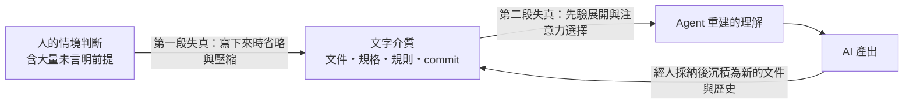
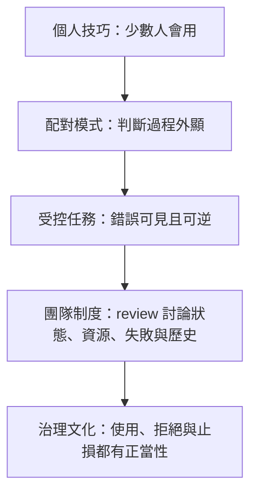

# AI 協作的失真預算：為何判斷力不能只靠外化，以及團隊如何守住培育路徑

**Structure**: Analytical Essay
**Date**: 2026-10-03T15:20
**Source**: notes
**Model**: Kimi K3
**Agent**: GitHub Copilot Chat v0.68.0

## 導言

設想一個常見的導入路徑：發帳號、開 prompt 教學課、整理模板與檢核表、把「AI 使用率」放進週報。幾個月後，產出速度確實上升了，但程式碼審查開始堆積，文件越來越厚而共識越來越薄，新人直接從「描述需求、審查產物」起步，卻說不清系統為什麼這樣設計。這是設想的情境，不是特定事故的記錄；它濃縮的是本文作者觀察到的反覆落差：組織把 AI 協作當成工具擴散問題處理，而真正的瓶頸往往不是工具知識。

本文要回答的核心問題是：為什麼分發工具、模板與規則，不足以讓團隊長出 AI 協作所需的判斷力？這個問題影響每一個正在導入 AI 的工程團隊，以及需要為產能與品質負責的管理者。讀完本文，讀者應能判斷：哪些知識可以被文字介質承載、哪些只能內化；一套規則在什麼條件下是助力、在什麼條件下成為幻覺；什麼時候不用 AI 反而是正確決策；以及為什麼「會手寫核心路徑」仍是審查 AI 產出的資格來源。

本文的核心主張是：**人機協作**（Human-AI Collaboration）的可持續性取決於人類判斷力的培育，而不是 AI 採用率。文字產物可以傳遞部分狀態，卻不能無損搬運人的情境判斷；判斷力大部分是**默會知識**（Tacit Knowledge），主要在有回饋的實踐中形成——這個限定會在分析與反思中展開。當組織把導入策略設計成「更多規則、更高採用率、更少手寫」，它看似在提高效率，實際上可能在消耗未來的判斷力儲備。因此 AI 協作治理要回答的不是「如何讓大家都用 AI」，而是「如何讓人在使用 AI 的同時，仍然學會判斷、驗證、拒絕與負責」。

## 分析

要回答導言的問題，需要一條推理鏈：先說明文字介質為何有結構性的傳輸上限，再說明繞過這個上限的管理手段為何失效，接著拆解 AI 協作實際需要的能力光譜，然後把視角放大到**團隊擴散**（Team Diffusion）與組織層級，最後落回兩個最實務的問題——什麼時候不用 AI，以及手寫程式碼為何不可省略。以下各節依此順序展開。

### 文字介質的兩段失真：失真預算從何而來

AI 協作依賴文字介質跨越一個基本落差：人類協作需要狀態延續，而大型語言模型的單次呼叫本身是**無狀態**（Stateless）的——模型不保留跨呼叫的內部狀態，應用層的「記憶」其實是把歷史內容重新傳入下一次呼叫。一次決策的理由、某個設計禁忌、對未來審查者的提醒，都必須被寫進文件、規格、commit message 或規則檔，才能進入下一次推理的上下文。文字產物因此承擔了狀態介質的角色。

這個介質有結構性失真。第一層失真發生在人把判斷寫成文字時。知識論學者 Polanyi 在 1966 年出版的知識論著作《The Tacit Dimension》開篇即寫道「we can know more than we can tell」（第 4 頁；本文譯為「我們能知道的，多於我們能說出的」）；他把這種無法完全言傳的知識稱為默會知識。判斷力正是默會知識的典型：它運作在幾乎無限的情境維度上，而任何規則只能捕捉有限條件；書寫者還會系統性地省略自己覺得不言而喻的前提——恰恰是被省略的前提，對接收者最關鍵。

社會學者 Collins 在 2010 年出版的《Tacit and Explicit Knowledge》一書中把默會知識拆成三類：關係性默會（原則上可以說明，只是需要有人付出說明的努力）、身體性默會（長在身體裡的技能，如騎車）、集體性默會（屬於整個社會的知識，如語言的使用規則）。本文推論：這個分類對 AI 協作的含義是，文件能改善的主要是關係性默會——補上沒說出口的部分；對集體性默會，文字只能記錄結論，形成結論的實踐仍須透過參與獲得。甚至連知識管理領域最樂觀的經典也不主張無損轉換：Nonaka 與竹內在 1995 年出版的企業知識創造研究中提出默會與明示知識相互轉換的框架，其中把默會知識表達為概念的「外化」依靠隱喻、類比與對話這類迂迴手段，而學徒式的共同勞動在該框架中屬於另一種模式——不透過語言的默會傳遞。兩者都不是無損的壓縮，而是需要昂貴社會條件配合的部分轉換。

第二層失真發生在文字被 Agent 讀入時。短文本會被模型先驗展開，長文本會被注意力機制選擇性關注。規則越少，解釋空間越大；規則越多，規則之間的優先序越容易被重新排序。兩層失真疊加，形成本文所稱的**失真預算**（Distortion Budget）。本文推論：對同一個文字介質存在一個負荷拐點——拐點之內，文件與規則提供必要約束；超過拐點之後，繼續增加文字主要增加的是解釋空間與優先序衝突，可靠性不再隨文字量上升。這是從兩段失真機制推導的假說，不是已量測的規律；反例方向確實存在——結構良好、可檢索的權威內容可能降低歧義，因此拐點的位置取決於內容品質與組織方式，而非單純的文字量。



圖中值得注意的迴路在右下：AI 產出經人採納後，沉積為新的文件與歷史——採納這個動作本身就是一次判斷，若它流於形式，失真就進入存量。若第一段失真已讓文字偏離原意，基於模糊歷史產出的新內容會把模糊傳給下一代文件，失真因此不是一次性損耗，而是會複利累積的存量。許多 AI 協作的失效不是因為規則寫得不夠多，而是因為團隊誤以為任何判斷都可以繼續壓縮進同一個文字介質。也因此，失真預算無法直接度量，只能透過症狀間接觀測——當規則持續增加而意外並未減少、當新成員讀完文件仍無法重現老成員的判斷，預算很可能已經超支。

### 外化陷阱：合規為何取代溝通

既然文字介質有上限，管理直覺為何總是繼續加碼？因為外化是組織唯一看得見的槓桿。當 commit message、規格或 AI 產出的品質不穩，最直接的反應是加模板、加欄位、加檢核表、加 lint。這些手段對**技術技能**（Technical Skill）確實有效，因為格式、語法與流程的正確答案相對穩定，可以標準化。但判斷力不是格式問題。一則好的 commit message 之所以好，不只是欄位填滿，而是作者知道未來的人與 Agent 需要哪些資訊才能還原意圖——這個「知道」無法被欄位保證。

當組織用更多外化規則替代這種能力，合規就開始取代溝通。操作者開始填表，而不是判斷什麼值得記錄；審查者看到欄位齊全，卻仍要自行重建意圖。規則集還會出現**棘輪**（Ratchet）效應：每次事故新增一條規則，卻少有機制移除過時的規則，文字介質於是越變越厚，信噪比越來越低。

評估學者 Campbell 在 1979 年一篇檢討社會計畫評估方法的論文中指出：定量指標一旦被用於決策，就會承受腐化壓力，並反過來扭曲它原本要監控的過程——這個觀察後來被稱為**坎貝爾定律**（Campbell's Law）。採用率、規則數、欄位齊全率恰好都是這種指標：它們容易量測，於是被當成目標；一旦被當成目標，團隊就學會了讓指標好看，而不是讓判斷變強。合規取代判斷的完整治理病理學已在別處有充分討論，本文只需保留它在能力培育上的那一半後果：當檢核表被用來證明「沒有判斷力的人已完成審查」，它製造的不是安全，而是合規幻覺；當它被用來提醒有判斷力的人，它才真正有價值。這個區分將在實務對比一節由外科醫學的證據具體化。

### 能力拆解：五種能力與觀念化能力的形成

外化手段為何對某些能力有效、對另一些無效，需要先把能力拆開。AI 協作至少牽涉五種能力——技術技能、**觀念化能力**（Conceptual Skill）、**人際技能**（Human Skill）、**驗證能力**（Verification Skill），以及知道何時停止的**拒絕能力**（Refusal Competence）：

| 能力 | 作用 | 是否適合外化 | 典型失效樣態（本文推論） |
| :--- | :--- | :--- | :--- |
| 技術技能 | 工具操作、語法、指令、固定流程。 | 適合，因為正確答案相對穩定。 | 參數誤用、指令錯誤等可直接偵測的操作失誤。 |
| 觀念化能力 | 把模糊情境抽象為可操作模型，判斷其邊界與限制。 | 不適合完整外化，只能透過練習內化。 | 問題框架錯誤：把錯的問題解得很好。 |
| 人際技能 | 讓團隊同步判斷、共識與責任分工。 | 可被流程支持，但不能被流程取代。 | 共識錯覺：以為說清楚了，其實沒有。 |
| 驗證能力 | 分辨產出是自洽、正確、可信，還是仍然不確定。 | 可被工具輔助，但核心依賴領域經驗。 | 被流暢外觀說服，放過接近正確的成品。 |
| 拒絕能力 | 知道何時停止 AI、改用人手、縮小範圍或要求證據。 | 需要成本模型與專業判斷共同支撐。 | 沉沒成本續投：互動越久越不願放棄。 |

五者之中最容易被低估的是觀念化能力。它不是知道某個工具有哪些參數，而是在提問之前預測 Agent 可能怎麼展開，判斷哪些上下文會污染方向，並據此調整問題的範圍與結構。這種**設問式操作**（Socratic Prompting）看起來像 prompt 技巧，實際上是即時建模能力，依賴當下情境、任務風險、系統歷史與模型行為的綜合判斷，無法被有限規則完全覆蓋。

這種能力如何形成？技能習得研究有一個更嚴肅的版本。Dreyfus 在 2004 年一篇摘要其與 Hubert Dreyfus 共同發展之模型的文章中，重述了成人技能習得的五個階段：新手依賴與情境無關的規則，進階初學者開始辨認情境特徵，勝任者能在複雜中選擇計畫，精通者以直覺直接感知情境，專家的行動則是內化後的直覺反應。這個模型的關鍵不在階段數，而在方向：技能沿著「從規則驅動到情境直覺」的軸線移動。本文推論：若這個方向成立，從規則到直覺的轉變就必須經過大量有真實後果的情境，旁觀與閱讀規則無法替代——AI 協作是否適用同一機制，是本文的類推。

培訓界另有一個流傳更廣的四階段說法：無意識的無能、有意識的無能、有意識的能力、無意識的能力。需要交代的是，這個模型是管理訓練界的通俗模型而非實證研究：據現有文獻可追溯至 1960 年一本管理訓練教科書（De Phillips et al., 1960），1970 年代由 Gordon Training International 的 Noel Burch 以「學習任何新技能的四階段」之名推廣，後來常被誤歸給 Maslow。本文引用它只取一個直覺：從第一階段跨到第二階段的關鍵轉折，是人開始看見自己與高品質操作者之間的差異，並意識到差異不在模板而在思維方式。團隊能做的不是把這條路壓縮到零，而是創造足夠多安全、具體、可比較的判斷場景，讓這個轉折早一點發生。

不過，「大量情境」本身還不夠。心理學家 Kahneman 與 Klein 在 2009 年一篇刻意尋求共識的對談論文中，為直覺專業的可信度提出兩個條件：環境必須有足夠穩定、可學習的規律（高效度），且學習者必須有充分機會在這些規律上獲得回饋。這對 AI 協作是一個警訊：本文觀察到，模型的行為會隨版本更替而漂移，提示與輸出之間的規律並不穩定，回饋又常被流暢的表達掩蓋。也就是說，AI 協作環境的效度低於消防或臨床這些傳統專業領域（本文推論：這是類推，原論文討論的不是 AI 情境），觀念化能力的維持因此需要刻意設計。刻意練習研究同樣支持這一點：Ericsson 等人在 1993 年發表於《Psychological Review》的經典綜述指出，專家表現的關鍵預測變數不是經驗總量，而是刻意練習——位於能力邊緣、有明確目標與即時回饋的練習。這三個條件在後文的手寫訓練設計中會再次出現。

### 團隊擴散：個體差異無法被統一培訓消除

把視角從個人放大到團隊，問題變成：為什麼同一套 AI 工具與培訓，在不同人身上效果相反？因為個體起點差異是真實的。技術深度足夠的人能把 AI 當加速器，因為他知道哪些地方要驗證；深度不足的人可能被 AI 的專業外觀說服。高模糊耐受的人上手快，但容易放過「幾乎正確」的陷阱；低模糊耐受的人起步慢，卻可能有更強的審查紀律。探索型的人需要護欄，計畫型的人需要可靠性框架。統一培訓壓不平方差，只會把品質方差從可見的產出，轉移到不可見的判斷品質。

學習理論為「那該怎麼辦」提供了兩個互補的支架。Lave 與 Wenger 在 1991 年出版的學習民族誌研究《Situated Learning》中主張，學習本質上是參與軌跡的改變：新手從「合法邊緣參與」開始，在真實實踐的邊緣承擔真實但低風險的部分，逐步移向核心。知識不是被搬運進腦袋的貨物，而是在參與中長出來的。Collins、Brown 與 Newman 在 1989 年一篇收錄於 Resnick 主編的認知科學論文集的章節中，把傳統學徒制轉譯為認知領域的**認知學徒制**（Cognitive Apprenticeship）：師傅先示範（modeling）並把內在過程外顯，再在學徒操作時給予指導（coaching）與鷹架（scaffolding），並要求學徒把推理說出來（articulation）、回顧比較（reflection），最後獨立探索（exploration）。

把這兩個支架放回 AI 協作，團隊擴散的成熟度可以表示為一條階梯——本文建議的參考路徑，而非必然依序發生的階段——依序是個人技巧、**配對模式**（Pair Collaboration）、受控任務、團隊制度與治理文化：



這條階梯的每一階都對應一種學習機制，而不只是一個管理動作（本文推論：階梯與機制的對應是本文的綜合，非單一來源的主張）。配對模式的價值不只是教工具，而是讓資深工程師把平常無聲完成的判斷說出來——這正是 modeling 與 articulation。受控任務的價值不只是「簡單」，而是錯誤能立即暴露且可逆，提供合法邊緣參與所需的低風險真實實踐。團隊制度的價值不只是流程一致，而是把 AI 產出重新放回人類能討論的架構語境中，讓 reflection 有場合發生。階梯的重點不是讓每個人同速前進，而是讓判斷力的形成有場域。

### 何時不用 AI：損益平衡、止損與自我定位的不可靠

在這個框架下，「什麼時候不用 AI」不是反 AI 立場，而是能力治理的必要邊界。可以用一個矩陣整理：

| 對問題的理解程度 | AI 的可能價值 | 主要風險 | 建議（本文建議） |
| :--- | :--- | :--- | :--- |
| 完整理解 | 低，AI 多半只是打字中介。 | 準備上下文、等待與驗證的成本超過直接動手。 | 允許直接手動，尤其是小修與已定位的 bug。 |
| 部分理解 | 高，AI 可協助探索與補齊。 | 需要足夠能力驗證 AI 補出的部分。 | 適合協作，但要設驗證與**止損**（Stop-Loss）條件。 |
| 幾乎不理解 | 不穩定，AI 可提供學習入口。 | 專業外觀掩蓋未知，產生無法判斷的半成品。 | 用於探索與提問，不宜直接產出高風險變更。 |

三格的分界依兩個對象評估：對這項任務的需求理解多少、對這個系統的行為理解多少；理解程度不是穩定的自我標籤，同一個人對不同子系統可能落在不同格（本文推論）。

這個矩陣背後的成本結構可以寫得更精確。以下數值皆為本文設定，用於說明結構而非實測：設 AI 路徑的總成本為準備上下文、等待生成、驗證產出三項固定成本，加上返工機率乘上返工成本；手動路徑則是實作與自我檢查兩項。AI 路徑划算，當它的總成本低於手動路徑。下面的模型讓讀者可以直接檢查這個結構的三個後果：完整理解時 AI 反而更貴；部分理解且返工率低時 AI 較省；同一任務存在一個臨界返工率，超過之後 AI 由省轉貴。

```python
# 情境與數值皆為本文設定，用於說明成本結構，不是實測資料
def ai_cost(prep, generate, verify, p_rework, rework):
    return prep + generate + verify + p_rework * rework

def manual_cost(implement, self_check):
    return implement + self_check

# 情境一（設想）：修一處已定位的錯字，修改者完全理解問題
typo_ai = ai_cost(prep=6, generate=3, verify=4, p_rework=0.05, rework=30)
typo_manual = manual_cost(implement=2, self_check=1)
assert typo_ai > typo_manual          # 完整理解時 AI 路徑反而更貴

# 情境二（設想）：在不熟的子系統補邊界處理，修改者只有部分理解
prep, generate, verify, rework = 15, 10, 25, 80
base = prep + generate + verify       # 準備 + 生成 + 驗證的固定成本
explore_manual = manual_cost(implement=100, self_check=20)
assert ai_cost(prep, generate, verify, 0.3, rework) < explore_manual  # 返工率低時 AI 較省

# 臨界返工率：使兩條路徑成本相等的 p_rework
p_star = (explore_manual - base) / rework
assert 0 < p_star < 1  # 本設定下成立；一般條件是 0 < 手動成本 − 固定成本 < 返工成本
assert ai_cost(prep, generate, verify, p_star - 0.01, rework) < explore_manual
assert ai_cost(prep, generate, verify, p_star + 0.01, rework) > explore_manual
```

依所列公式計算，情境二的臨界返工率是 0.875：返工率低於它，AI 路徑較省；高於它，手動較省。這是單次返工的簡化期望成本模型：它假設返工成本固定、各項成本互不影響，且只計入一次返工；「理解程度」出現在情境設定裡，不是模型計算的結果，模型與三格矩陣之間是概念對應，不是推導關係。它能檢查的只有設定的算術後果——決策變數是驗證成本與返工機率，而不是採用率；臨界值存在的條件寫在斷言旁，讀者可以改動數值自行檢查。它無法告訴任何團隊實際的數值，那些必須靠記錄每次 AI 互動的準備時間、驗證時間與返工次數來實測。本文建議：止損條件（例如互動超過一定時間或返工次數後改用人手）正是把這個不可觀測的臨界值，轉換成可執行的組織規則。

矩陣還有一個盲點：判斷自己落在哪一格，本身也需要判斷力。Kruger 與 Dunning 在 1999 年發表於人格與社會心理學期刊的實驗研究中發現，在幽默、文法與邏輯測驗中表現最差的參與者，系統性地高估了自己的測驗表現——這個發現後來被稱為**達克效應**（Dunning-Kruger Effect）。本文類推：評估「自己對問題理解多少」所需的能力，與理解問題所需的能力高度重疊，因此越缺乏判斷力的人，越可能錯估自己落在矩陣的哪一格。所以「不用 AI」不能只留給個人良心。這也是為什麼止損需要組織空間——允許工程師說「這個任務手動更便宜」，允許用成本資料挑戰高採用率的表面成功。

人因工程文獻提供了另一側的對稱警告。Parasuraman 與 Riley 在 1997 年發表於《Human Factors》的綜述中檢討了人對自動化的四種關係——使用、誤用、棄用與設計端的濫用；本文聚焦其中兩種失效模式：誤用（過度依賴不值得信任的自動化）與棄用（不當地關閉本可幫忙的自動化）。Lee 與 See 在 2004 年同刊的信任研究綜述中進一步主張，目標不是提高或降低信任，而是讓信任與系統在當前情境的實際能力相稱。拒絕能力因此不是「少用 AI」的傾向，而是這種相稱性的執行面：知道自己落在哪一格、該依賴多少。

若組織反過來強制所有任務都經過 AI，就把可選開銷變成強制開銷。兩分鐘能修好的錯字，可能被迫經歷提示、上下文準備、生成、額外驗證與 token 成本。更隱蔽的是上下文本身會漂移：規則過時、規格與實作不同步、歷史文件互相矛盾，工程師花時間修上下文，從報表上看卻像是在慢慢修 bug——採用率上升，淨效益未必上升。這裡還有一層產能錯覺，本文只保留結論：AI 擴充生成產能的速度，通常快於組織有效驗證能力的成長，因為驗證仍高度依賴人的領域經驗；若**產能規劃**（Capacity Planning）把 AI 增益當成穩定平均值，卻沒有配置相應的人類審查與返工緩衝，瓶頸前就會累積越來越多看似完成的**在製品**（Work In Progress）。最危險的產出不是明顯錯誤的，而是自洽、整潔、能通過表層檢查，卻在真實邊界下偏離系統意圖的。

### 手寫的價值：判斷資格、系統物理感與自動化反諷

最後一塊拼圖是手寫程式碼。它的價值必須重新定位：不再是主要產能來源，而是判斷資格的來源。懂得手寫核心路徑的人，知道查詢不是抽象地取得資料，而是索引、鎖、等待與回滾；知道重試不是「再試一次」，而可能放大流量；知道快取不是速度魔法，而是對權威來源與失效策略的承諾。這種對系統在壓力下實際行為的體感，本文稱為**系統物理感**（Systems Physicality）。它讓人能在 AI 給出流暢答案時追問：這在我們的壓力場景下仍然成立嗎？

自動化取代基礎實作的風險，早在 AI 之前就被指出了。人因工程學者 Bainbridge 在 1983 年發表於《Automatica》的經典短文中提出**自動化反諷**（Ironies of Automation）：設計者把例行工作自動化之後，留給操作員的任務反而更困難——因為剩下的都是不規則的異常，而操作員的技能又因為長期不操作而退化，卻要在自動化失敗的那一刻接管。Endsley 與 Kiris 在 1995 年發表於《Human Factors》的實驗研究為其中一個機制提供了測量：在他們的導航任務實驗中，自動化條件下的參與者從主動處理轉為被動監控，情境察覺較低，而較低的情境察覺與自動化失效後較差的接管決策表現相關——他們稱之為**迴路外部**（Out-Of-The-Loop）績效問題。再加上**自動化偏誤**（Automation Bias）——航空心理學的實驗研究發現，操作員傾向採信自動化建議而降低獨立查核（Mosier et al., 1998）——三者合起來描述了一條相互強化的退化鏈：自動化拿走練習，練習流失削弱監控，監控削弱使自動化的錯誤更難被攔截。

這條鏈在軟體人才培育上的對應是直接的。傳統工程能力很大一部分來自底層實作：處理競態條件、追資料庫鎖、修重試風暴、理解 worker 崩潰後狀態如何恢復。這些經驗看似低階，卻是高階判斷的養分。AI 若太早拿走這些工作，初階工程師可能直接被推上「描述架構、審查產物、整合系統」的位置，卻還沒有形成足夠的系統物理感——於是出現反轉：AI 最需要人提供的（邊界意識、失敗想像力、裁決能力），正是 AI 容易讓新人少經歷的。人才斷層的完整討論在別處，本文保留它在能力鏈上的位置即可：斷層斷的不是「會不會手寫迴圈」，而是失敗想像力、局部與整體之間轉換的能力、以及拒絕工具的能力，不再自然形成。

健康的分工因此不是「AI 寫、人類審」這麼簡單。本文推論：在 AI 生成的情境下，審查往往比撰寫承擔更重的判斷負擔——審查者必須在撰寫意圖不在場的情況下重建它，還要提防流暢外觀帶來的信任。本文建議按風險分層：低風險、低耦合、可快速驗證的程式碼，可以大量交給 AI 展開；中風險模組，讓 AI 生成候選版本，但人要審查狀態、錯誤與資源模型；高風險核心路徑，先由人手寫最小版本或定義不可違反的不變式，再讓 AI 協助補測試、找反例與改善表達。更好的培育路徑，是讓 AI 變成訓練場而不是代工廠：初階工程師可以用 AI 產生反例、壓力測試、替代設計與測試矩陣，但不應一開始就把核心可靠性模型交給 AI 完成。團隊可以保留手寫演練——小型佇列、限流器、交易補償流程、逾時包裝器、狀態機。這些練習不一定直接進產品，但它們符合刻意練習的三個條件：位於能力邊緣、目標明確、成敗有即時回饋（Ericsson et al., 1993），建立的正是拒絕平均解的能力。

## 反思

本文最重要的張力，是外化與內化之間的錯位。組織自然偏好外化，因為外化看得見、可度量、可審核：有文件、有模板、有採用率、有檢核表。但真正決定 AI 協作品質的，往往是內化後的判斷：知道何時補上下文、何時縮小範圍、何時要求證據、何時停止、何時自己動手。這不代表外化無用——技術技能、固定流程、機械檢查、低風險產物都應該被外化和自動化。問題是邊界要清楚：外化可以支援判斷，但不能假裝取代判斷。

另一個張力是效率與培育。AI 確實能讓許多產出變快，但若所有低階工作都被消除，低階工作過去承擔的訓練功能也會一起消失。成熟工程師可以跳過樣板，因為他已經知道樣板背後的力學；初階工程師若從未碰過力學，只看到 AI 產出的完整外觀，就可能把形狀誤認為成熟。用「有沒有使用 AI」作為成熟指標，恰好落入坎貝爾定律的陷阱。更好的問題是：哪些任務允許不用 AI？哪些任務有止損條件？哪些核心路徑要求人先手寫或先定義不變式？review 是否仍在同步團隊的架構記憶？AI 是否被用來產生反例，而不只是產生實作？新人是否有機會在安全的環境中親自遭遇系統失敗？

本文的論證也有必須明示的邊界。第一，失真預算是從機制推導的假說而非已量測的規律，只能透過症狀觀測，無法給出量測方法；把它量化（例如以文件長度或規則數推估）反而可能製造新的代理指標。第二，五種能力的拆法是分析用的分類，不是經過心理計量驗證的構念。第三，Kahneman 與 Klein 的效度條件、Dreyfus 的技能階段、以及四階段學習模型，原生的論證場域都不是 AI 協作；本文對它們的使用是類推，類推的強度取決於讀者是否接受「判斷力的形成機制跨領域相似」這個前提。第四，成本模型的數值是本文設定，不是實測；任何團隊要據此決策，都應先記錄自己的準備、驗證與返工成本。

## 實務對比

軟體業不是第一個面對「機器放大產能、人保住判斷」這個問題的行業。航空、西洋棋與外科醫學各自以數十年的時間處理過同一結構的三個變形。它們的經驗不能替代 AI 團隊的直接證據，但能提供對照與提示，也能標出本文主張的邊界。

**航空：強制自動化之後，接管能力在哪裡？** 2013 年 7 月，韓亞航空 214 號班機在舊金山機場進場時撞上汽堤，機身斷裂起火，三人罹難。美國國家運輸安全委員會在 2014 年公布的事故調查報告（NTSB/AAR-14/01）中認定，事故的可能原因是機組對進場的管理不當、自動油門控制的意外解除、對空速的監控不足，以及發現偏差後重飛執行過遲；促成因素包括自動油門與飛行導引系統的複雜性在製造商文件與公司訓練中描述不足，提高了模式錯誤的可能性。與本文直接相關的細節是：肇事飛行員對飛機自動化邏輯的心智模型有誤，而韓亞航空的自動化政策強調全程使用自動化，並不鼓勵在航線營運中手動飛行。值得對照的是，美國聯邦航空總署在事故發生前約半年，即 2013 年 1 月，已發布名為《Manual Flight Operations》的安全警示（SAFO 13002），建議業者在日常營運中保留手動飛行的機會以維持操作技能。這個案例與本文的兩個機制在類比層級互相印證——單一事故無法單獨識別因果，但它顯示自動化反諷描述的張力（自動化拿走練習，卻把最難的接管時刻留給人）確實在航空業以事故調查報告的形式出現過，而一家公司的使用政策，確實會改變操作員保有手動技能的機會。AI 編程助手與自動駕駛儀在「高可靠性但非全能的代理」這一點上結構相似，但兩者的失誤可逆性、回饋速度與安全後果都不同；「預設全程使用」與「保留手動路徑」之間的政策選擇，是軟體團隊可以借鑑、卻不能直接照搬的問題。

**西洋棋：流程品質曾經擊敗棋力與算力，後來呢？** 2005 年，在 Playchess 伺服器上舉行的 PAL/CSS 自由式西洋棋錦標賽——一種允許人與電腦以任何形式組隊的賽制——出現了著名的冷門。據賽事平台方的報導，由 Steven Cramton（美國西洋棋協會等級分 1685）與 Zackary Stephen（等級分 1398）兩名業餘棋手組成的 ZackS 隊，使用三台普通個人電腦與數套商業引擎，一路擊敗配備強大電腦的特級大師隊伍，決賽以 2.5 比 1.5 擊敗十四歲的特級大師 Vladimir Dobrov 與其等級分 2600 以上的搭檔（ChessBase, 2005）。西洋棋前世界冠軍 Kasparov 在 2010 年《紐約書評》一篇回顧人機西洋棋史的文章中，從這類自由式賽事歸納出一個著名觀察（大意）：較弱的人加上機器加上更好的協作流程，可以勝過強大的電腦單獨作戰，也勝過強者加機器加上拙劣的流程。這個案例支持本文的觀念化能力主張——但只是示例層級的支持：單一賽事無法排除運氣、對手準備等因素，它展示的是流程設計「可以」成為決勝變數，而非證明它必然是。引用這個案例也必須連同它的邊界：ZackS 的勝利發生在 2005 年，當時的引擎遠不如今日；在西洋棋這種規則封閉、勝負完全可驗證的領域，機器算力的持續增長會不斷壓縮人對結果的相對貢獻，人的判斷角色理論上可以縮減到零（本文推論）。軟體系統不同：需求來自外部、失敗有真實後果、系統必須在新穎條件下持續運行，判斷力可退出的空間因此截然不同。這個邊界與個案本身同樣重要。

**外科：檢核表有效，因為它嵌入在判斷力的生態裡。** Haynes 等人在 2009 年發表於《新英格蘭醫學期刊》的八國八院前瞻性研究中報告，世界衛生組織十九項手術安全檢核表的導入，與死亡率從 1.5% 降至 0.8%、住院併發症從 11.0% 降至 7.0% 同時出現。乍看這是外化的勝利：一張紙拯救生命。但研究作者自己的機制討論更值得細讀：他們明言改善的確切機制無法完全釐清，很可能是多因子的——檢核表的施行同時強制了術前團隊自我介紹、簡報與術後回顧等溝通儀式，而且無法排除部分效果來自受試者意識到被觀察。本文據此提出的是解釋而非研究結論（本文推論）：檢核表在此不是取代判斷的證明，而是觸發判斷與溝通的儀式——執行它的是經過長年學徒制訓練、肩負法律與倫理責任的專業者，表上的每一項都由有能力判斷例外的人朗讀。若這個解釋成立，它正是外化陷阱一節的正面版本：同樣是檢核表，在判斷力生態完整的環境中是放大器，在被當成合規證明的環境中是幻覺。

三個領域合看，共同的提示是（本文推論）：正式化的機械輔助——清單、自動駕駛儀、引擎——都只在人的判斷被刻意維持時才穩定發揮作用；差異在於領域的封閉性決定了人最終可以退出多少。軟體工程比外科開放，比西洋棋更開放，因此 AI 協作的設計預設應該更接近航空的教訓：保留手動路徑不是浪費，而是接管能力的來源。

## 結論

AI 協作的可持續性取決於人類判斷力的培育，而不是 AI 採用率。這個結論由一條推理鏈支撐：文字介質有兩段結構性失真，判斷力作為默會知識無法被無損外化，失真預算的假說因此值得認真對待；繞過預算的外化加碼會讓合規取代溝通，並被代理指標腐化；AI 協作真正需要的是五種能力的光譜，其中的觀念化能力主要在有真實後果與即時回饋的情境中形成；個體差異使統一培訓不足以解決問題，團隊擴散需要以配對、受控任務與制度設計重建學徒制的條件；「何時不用 AI」有可計算的成本結構，但自我定位不可靠，止損必須是組織規則而非個人良心；手寫核心路徑是判斷資格的重要來源，自動化反諷提醒我們，放棄它可能等於在最需要接管能力的時刻失去它。

真正成熟的人機協作，不是讓人少判斷，而是讓人把判斷用在更關鍵的位置：AI 負責展開，人負責邊界；AI 負責候選答案，人負責裁決；AI 負責提高成功路徑的速度，人負責想像失敗路徑。手寫能力、配對討論、故障注入、成本可視化與不用 AI 的正當性，都是為了守住這個分工。能力培育不是 AI 導入的附屬配套，而是 AI 導入本身的核心治理問題——組織不能只問如何把更多工作交給模型，還要問如何讓更多人逐漸成為能控制模型、驗證模型、拒絕模型的人。這條路比較慢，但它保護的是未來仍有人知道系統為什麼成立。

## 參考文獻 (References)

Bainbridge, L. (1983). Ironies of automation. *Automatica*, 19(6), 775–779. https://doi.org/10.1016/0005-1098(83)90046-8

Campbell, D. T. (1979). Assessing the impact of planned social change. *Evaluation and Program Planning*, 2(1), 67–90. https://doi.org/10.1016/0149-7189(79)90048-X

ChessBase (2005). Dark horse ZackS wins Freestyle Chess Tournament. *ChessBase News*, 2005-06-19. https://en.chessbase.com/post/dark-horse-zacks-wins-freestyle-che-tournament

Collins, A., Brown, J. S., & Newman, S. E. (1989). Cognitive apprenticeship: Teaching the crafts of reading, writing, and mathematics. In L. B. Resnick (Ed.), *Knowing, learning, and instruction: Essays in honor of Robert Glaser* (pp. 453–494). Lawrence Erlbaum. ISBN 9780805804607

Collins, H. (2010). *Tacit and explicit knowledge*. University of Chicago Press. ISBN 9780226113807

De Phillips, F. A., Berliner, W. M., & Cribbin, J. J. (1960). *Management of training programs*. Richard D. Irwin.（無 ISBN 可考的早期著作；初版 1960）

Dreyfus, S. E. (2004). The five-stage model of adult skill acquisition. *Bulletin of Science, Technology & Society*, 24(3), 177–181. https://doi.org/10.1177/0270467604264992

Endsley, M. R., & Kiris, E. O. (1995). The out-of-the-loop performance problem and level of control in automation. *Human Factors*, 37(2), 381–394. https://doi.org/10.1518/001872095779064555

Ericsson, K. A., Krampe, R. T., & Tesch-Römer, C. (1993). The role of deliberate practice in the acquisition of expert performance. *Psychological Review*, 100(3), 363–406. https://doi.org/10.1037/0033-295X.100.3.363

Federal Aviation Administration (2013). *Manual Flight Operations*（SAFO 13002，2013-01-04 發布）。（連結待補：FAA 官網現行有效連結未能定位）

Haynes, A. B., Weiser, T. G., Berry, W. R., Lipsitz, S. R., Breizat, A.-H. S., Dellinger, E. P., Herbosa, T., Joseph, S., Kibatala, P. L., Lapitan, M. C. M., Merry, A. F., Moorthy, K., Reznick, R. K., Taylor, B., & Gawande, A. A. (2009). A surgical safety checklist to reduce morbidity and mortality in a global population. *New England Journal of Medicine*, 360(5), 491–499. https://doi.org/10.1056/NEJMsa0810119

Kahneman, D., & Klein, G. (2009). Conditions for intuitive expertise: A failure to disagree. *American Psychologist*, 64(6), 515–526. https://doi.org/10.1037/a0016755

Kasparov, G. (2010). The chess master and the computer. *The New York Review of Books*, 2010-02-11. https://www.nybooks.com/articles/2010/02/11/the-chess-master-and-the-computer/

Kruger, J., & Dunning, D. (1999). Unskilled and unaware of it: How difficulties in recognizing one's own incompetence lead to inflated self-assessments. *Journal of Personality and Social Psychology*, 77(6), 1121–1134. https://doi.org/10.1037/0022-3514.77.6.1121

Lave, J., & Wenger, E. (1991). *Situated learning: Legitimate peripheral participation*. Cambridge University Press. ISBN 9780521423748

Lee, J. D., & See, K. A. (2004). Trust in automation: Designing for appropriate reliance. *Human Factors*, 46(1), 50–80. https://doi.org/10.1518/hfes.46.1.50_30392

Mosier, K. L., Skitka, L. J., Heers, S., & Burdick, M. (1998). Automation bias: Decision making and performance in high-tech cockpits. *The International Journal of Aviation Psychology*, 8(1), 47–63. https://doi.org/10.1207/s15327108ijap0801_3

National Transportation Safety Board (2014). *Descent Below Visual Glidepath and Impact With Seawall, Asiana Airlines Flight 214, Boeing 777-200ER, HL7742, San Francisco, California, July 6, 2013*（NTSB/AAR-14/01）. https://www.ntsb.gov/investigations/AccidentReports/Reports/AAR1401.pdf

Nonaka, I., & Takeuchi, H. (1995). *The knowledge-creating company: How Japanese companies create the dynamics of innovation*. Oxford University Press. ISBN 9780195092691

Parasuraman, R., & Riley, V. (1997). Humans and automation: Use, misuse, disuse, abuse. *Human Factors*, 39(2), 230–253. https://doi.org/10.1518/001872097778543886

Polanyi, M. (1966). *The tacit dimension*. Doubleday.（2009 年 University of Chicago Press 新版，ISBN 9780226672984）
